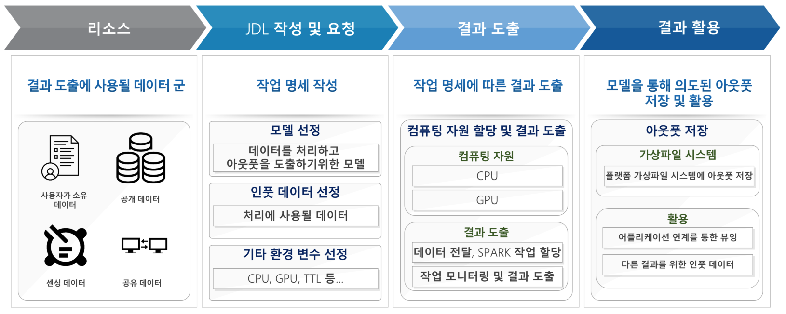
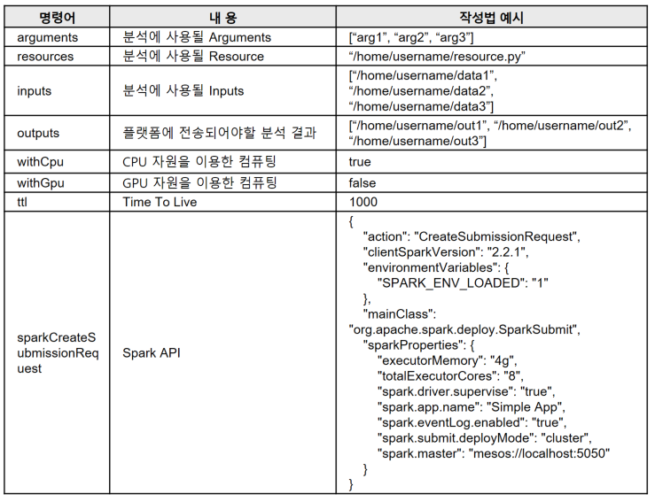
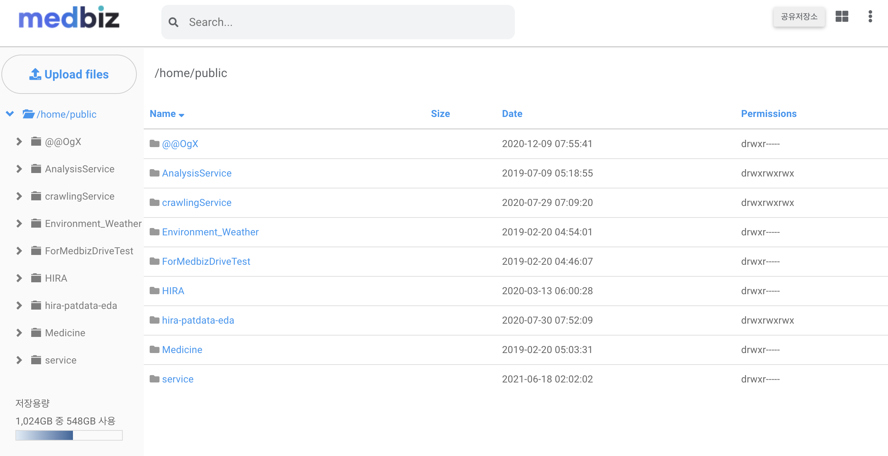
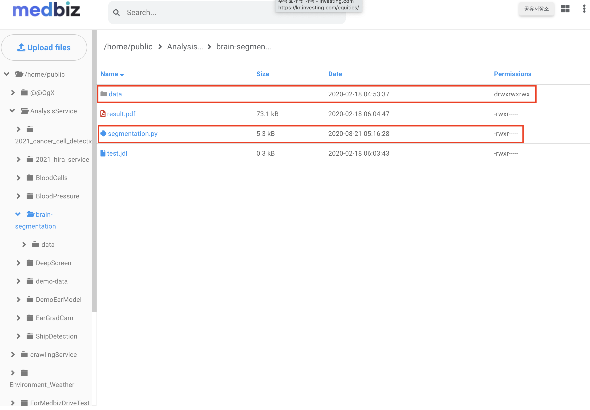
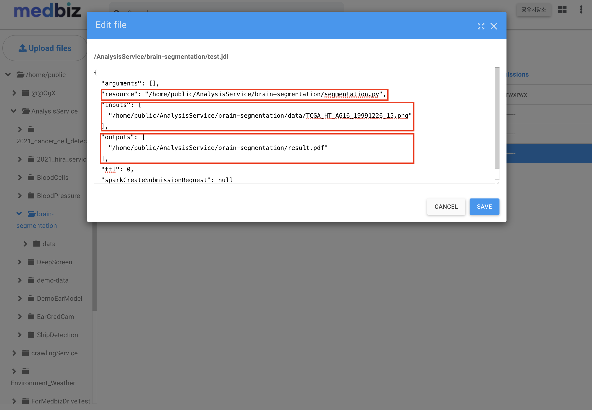

================================
MEDBIZ Platform 분석 기술
================================

MEDBIZ Platform 분석 기능에  대한 내용 작성

* `개요`_
* `JDL(Job Description Language) 기반의 결과 도출`_

-----
개요
-----
MEDBIZ Platform은 클라우드 형태의 가상파일 시스템 기술이 포함되어 있는데, 해당 가상 파일 시스템에 존재 하는 데이터를 기반으로한 결과 도출 기능을 지원하고 있음.

가상 파일 시스템을 기반으로 두가지 형태의 결과 도출 기능을 제공하고 있음

---------------------------------------------------
JDL(Job Description Language) 기반의 결과 도출
---------------------------------------------------

JDL는 결과 도출을 위한 인터페이스로 어떠한 분석 모델과, 입력 값을을 통해 결과를 도출할 지에 대한 명명서이다.

JDL을 이용한 작업 절차는 아래 이미지와 같음

아래는 JDL 명세서이다.

.. [1] VFS(Virtual File System) 클라우드 상위에서 JDL 이용방법

    JDL 명세서를 JSON 포멧을 파일형태로 저장하고, VFS 클라우드 상에서 Analysis 기능을 이용해 작업을 할당함

- https://vfs.medbiz.or.kr 클라우드 페이지로 이동

- 작업에 사용될 모델, 인풋 파일 데이터가 있다면 경로 정보, 아웃풋 파일 데이터가 있다면 경로 정보 등을 준비함

    - 모델 파일 segmentation.py
        (/home/public/AnalysisService/brain-segmentation/segmentation.py)
    - 인풋 데이터 경로 data
        (/home/public/AnalysisService/brain-segmentation/data/TCGA_HT_7877_19980917_23.png)
    - 아웃풋 경로
        (/home/public/AnalysisService/brain-segmentation/result.pdf)

- .jdl 형태의 파일 생성(빈파일을 생성하여 기입하여도 좋고, 로컬시스템에서 해당 내용을 작성하여서 업로드하여도 됨)
    - resource : 작업에 사용될 모델 파일 경로
    - inputs : 작업에 상요될 인풋 데이터 경로
    - outputs : 작업을 통해 산출되는 아웃풋 데이터가 저장될 경로

- 마우스 우클릭을 통해 해당 .jdl 파일에 명세된 작업을 수행시킴
- 작업 현황 패이지에서 해당 작업아 완료 되었는지, 상태는 어떤지에 대한 로깅 확인

.. [2] 기업용 페이지 > 데이터 분석 기능을 이용방법

- 해당 페이지는 JDL 명세서를 웹 Form 형태로 구현한 페이지로, 적절한 입력값을 해당페이지를 통해 입력하여 JDL 파일을 생성하거나, 바로 작업을 요청할 수 있다.

.. [3] 샘플 서비스 이용한 방법

- 웹 형태로 JDL기능을 랩핑한 어플리케이션으로, UI/UX 상에서 작업 방법과, 입력데이터를 선택하면 내부에서 JDL 형식으로 작업을 생성하고, 작업이 완료 되는데로 결과를 확인할 수 있는 페이지.

--------------------------------------------------
ETRI KSB(Bee AI) 연계, 결과 도출
--------------------------------------------------

Bee AI는 멀티 모달 데이터 처리, 동시학습 및 추론, 기계 학습 등이 가능하도록 설계 된 프레임워크이다.

Bee AI 프레임워크의 데이터 리소스로 MEDBIZ Platform의 API를 이용해 연계할 수 있도록 기술이 구현됨

.. [1] ㅁㄴㅇㄹ

