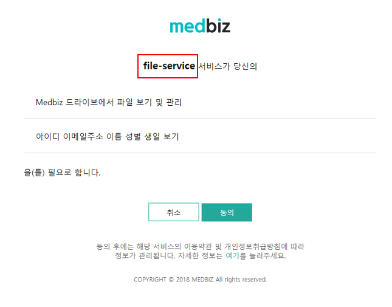

=============
오픈 API 사용법
=============

.. note::

    모든 medbiz 플랫폼의 API 호출은 access token을 필요로 합니다.
    `여기 <https://medbiz.readthedocs.io/en/latest/>`_ 을 확인하여 token을 얻고 사용하는 방법을 익힐 수 있습니다.

---------
개요
---------
MEDBIZ 플랫폼에서 제공하는 오픈 API를 활용해 다양한 서비스를 개발할 수 있습니다.

---------
서비스 개발 예
---------
#. `다이콤 뷰어 서비스 <https://service.medbiz.or.kr/dicom/>`_ 메드비즈 플랫폼에 저장된 dcm 파일들을 웹에서 확인할 수 있습니다.
#. `웹 파일 서비스 <https://vfs.medbiz.or.kr/>`_ 메드비즈 플랫폼에 파일을 업로드하고 다운로드할 수 있습니다.
#. `당뇨 관리 서비스 <https://service.medbiz.or.kr/diabetes/>`_ 메드비즈 플랫폼을 통해 당뇨 관리 서비스를 제공할 수 있습니다.

---------
사전 준비 사항
---------
MEDBIZ 플랫폼에서 제공되는 오픈 API들을 활용하기 위해서는 Oauth 2.0 기반 사용자 인증이 필요합니다. Oauth 2.0 기반 인증을 진행하기 위해 개발자 페이지에서 OauthClient 등록하고
클라이언트 아이디와 클라이언트 시크릿을 발급받아야 합니다. 클라이언트 아이디와 클라이언트 시크릿은 인증된 클라이언트(서비스)인지를 확인하는 수단이며, OauthClient가 등록되면 
발급됩니다. 등록된 클라이언트 아이디와 클라이언트 시크릿을 통해 MEDBIZ 로그인을 진행한 후 발급된 사용자의 AccessToken을 오픈API를 호출할 때 HTTP 헤더에 포함해서 전송해야 API를 
호출할 수 있습니다.

.. warning::

    MEDBIZ 플랫폼에 로그인한 사용자 계정으로 OauthClient가 등록됩니다. OauthClient를 등록한 MEDBIZ 아이디는 '관리자' 권한을 가지게 되므로 해당 MEDBIZ 계정의 보안에 각별히 주의해야 합니다.

OauthClient 등록
=====

MEDBIZ OauthClient 등록하기 위한 기본 절차는 아래와 같습니다.

#. `MEDBIZ 개발자 사이트 <https://dev.medbiz.or.kr/>`_ 로 접속하여 OauthClient를 등록할 계정으로 로그인합니다.

#. 좌측에 '클라이언트 등록'을 선택하여 클라이언트 등록 페이지로 이동합니다.

  .. image:: ./_static/oauth_client01.png

#. '클라이언트 등록' 페이지에서 필요한 정보들을 입력합니다. 각 속성의 의미는 아래와 같습니다.

.. image:: ./_static/oauth_client02.png

OauthClient 등록 세부 정보
--------

**어플리케이션 이름**

등록할 OauthClient의 이름을 입력합니다. OauthClient 이름은 최대 64자까지 입력할 수 있습니다.
사용자가 해당 OauthClient를 통해 MEDBIZ 로그인을 진행할 때 다음 화면처럼 MEDBIZ 아이디로 로그인 화면에 OauthClient 이름이 표시되므로 적절한 이름을 사용하는 것을 권장합니다.

**API SCOPE**

개발하고자하는 서비스에서 접근하고자 하는 사용자의 데이터 범위(사용하고자하는 MEDBIZ 오픈API)를 선택하는 항목입니다. 사용자가 이용하려는
서비스에서 접근할 필요가 없음에도 너무 많은 API 범위를 선택하면 사용자가 서비스를 거부할 수 있습니다.

   ===============  ==================================================
   SCOPE            내용
   ===============  ==================================================
   DRIVE            Medbiz 드라이브에서 파일 읽기/쓰기
   DRIVE_READONLY   Medibz 드라이브 파일 읽기
   PROFILE          아이디 이메일주소 이름 성별 생일 보기
   DEVICE           사용중인 디바이스 정보 보기
   APPLICATION      사용중인 어플리케이션 보기
   GROUP            속해져있는 그룹 보기
   GROUP_PROFILE    사용자 기본 그룹 정보 보기
   HEALTH           개인 의료 데이터 읽기
   ===============  ==================================================

**AUTH METHODS**

인증에 사용할 OAUTH2 접근방식을 선택합니다. 해당 속성값은 3개 모두 선택하시면 됩니다.

**WEB SERVER REDIRECT URL**

사용자가 인증 종료 후 돌아갈 수 있도록 제공되어야 하는 콜백 URL입니다. 인증서버는 사용자가 인증을 정상적으로 모두 수행하게 되면 해당 URL로
리다이렉트 시키게 되어있습니다. 서비스에서는 해당 URL을 외부로 OPEN하여 콜백을 받을 수 있도록 설정하여야하며 해당 콜백 URL에서 서비스 자체
회원가입을 시키거나 access token을 확인하는 등으로 개발을 진행할 수 있습니다.

OauthClient 아이디와 클라이언트 시크릿 확인
=====

Client ID와 Secret은 서비스를 개발할 때 MEDBIZ 로그인을 사용하기 위해 사용됩니다. 

Client ID와 Secret은 다음 메뉴에서 확인할 수 있습니다.

1. "OAuth Clients > 내 클라이언트" 메뉴로 이동 후 생성한 클라이언트 클릭

2. 우측 상단에 'SHOW CLIENT ID & SECRET' 메뉴를 클릭하면, Client ID와 Secret을 확인할 수 있는 창이 표시됩니다.

      .. image:: ./_static/oauth_client04.png

---------
오픈 API 종류
---------
MEDBIZ 플랫폼에서 제공되는 오픈 API들을 활용하기 위해서는 Oauth 2.0 기반 사용자 인증이 필요합니다. Oauth 2.0 기반 인증을 진행하기 위해
아래의 절차를 따라 개발자 페이지에서 OauthClient 등록을 진행해야합니다.

디바이스 오픈 API
=====

파일 오픈 API
=====

준비중입니다

헬스데이터 오픈 API
=====

준비중입니다

API Rate Limits
---------------

    현재 적용된 API에 대한 리밋은 없습니다.