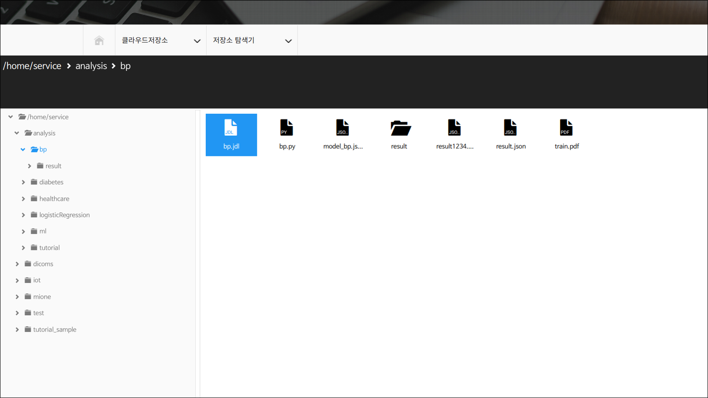
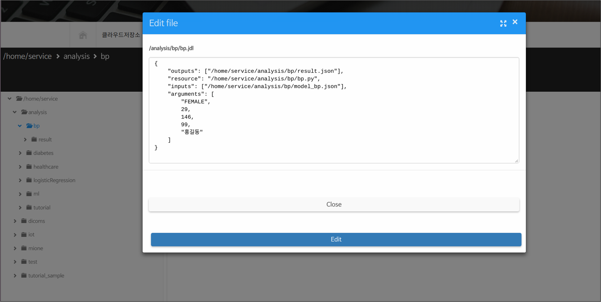
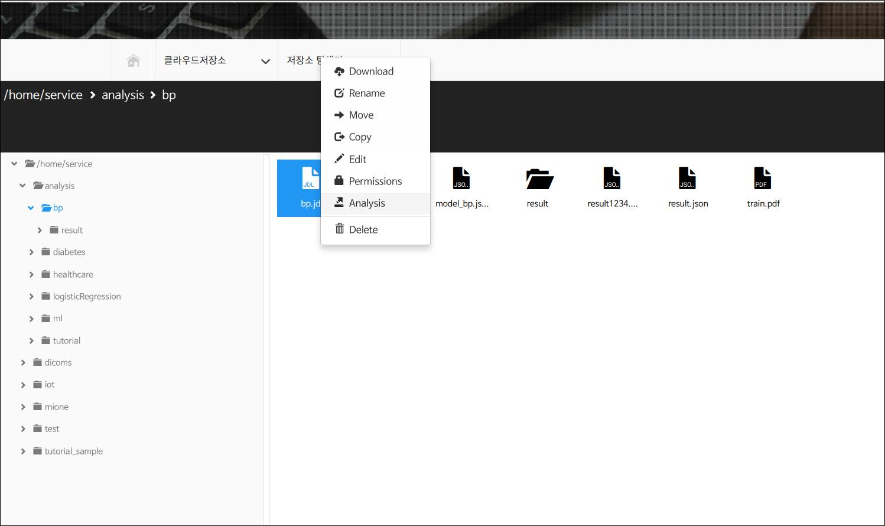
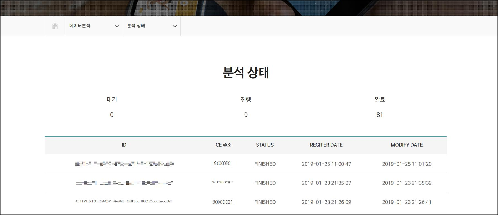

데이터 분석 스크립트 구동 방법
================================

.. contents:: 목차

다음과 같은 절차로 Medbiz 플랫폼에서 데이터 분석을 수행할 수 있다.

1. jdl 파일 작성 : 텍스트 편집기를 이용하여 jdl 파일을 작성
2. jdl 파일 업로드 : 작성한 jdl 파일을 클라우드 저장소로 업로드
3. Analysis 명령 실행 : 저장소 탐색기에서 Analysis 명령 실행
4. 분석 상태 확인 : "데이터분석 > 분석 상태" 메뉴에서 분석 상태 확인
5. 결과 확인 : 분석 작업 완료 후, 출력 파일 확인

jdl 파일 작성
-------------------------

jdl 파일은 Medbiz 플랫폼으로 데이터 분석 정보를 제공하기 위해 사용되는 텍스트 파일이다.

Windows 메모장과 같은 텍스트 편집기를 이용하여 jdl 문법에 따라 jdl 파일을 작성한다.

[ JDL 문법 ]
```````````````````````````````````

    .. code-block:: json

      {
        "outputs": ["/home/service/analysis/bp/result.json"],
        "resource": "/home/service/analysis/bp/bp.py",
        "inputs": ["/home/service/analysis/bp/model_bp.json"],
        "arguments": [
          "FEMALE",
          29,
          146,
          99,
          "홍길동"
        ]
      }

  * 위와 같이 resource, input, arguments, output의 4가지 구성요소를 갖는다.
     - **resource** : 분석을 위한 코드를 명시한다.
     - **input** : 분석에 필요한 데이터 파일들을 명시한다.
     - **arguments** : 분석에 필요한 기타의 인자들을 명시한다.
     - **output** : 분석하여 얻어질 결과 파일을 열거한다.

jdl 파일 업로드
-------------------------

저장소 탐색기를 이용하여 작성된 jdl 파일을 클라우드 저장소로 업로드한다.

추가로, jdl 파일의 **resource** 항목에 명시한 분석 코드 파일과 **input** 항목에 명시한 추가로 필요한 입력 파일이 있다면 함께 업로드한다. 

  * 클라우드 저장소 사용법은 Medbiz 가이드(혹은 매뉴얼)에서 "플랫폼 사용 가이드 » 클라우드 저장소" 부분을 참고 한다.




  [그림 2-1] jdl 파일 업로드
  
jdl 파일을 업로드한 후에는 저장소 탐색기에서 바로 jdl 파일을 수정할 수도 있다.



  [그림 2-2] 저장소 탐색기에서 jdl 편집

Analysis 명령 실행
-------------------------

클라우드 탐색기에서 jdl 파일에 마우스 오른쪽 버튼을 클릭하여, Analysis 메뉴를 선택한다. 그러면, Medbiz 플랫폼으로 Analysis 명령이 전달된다.



  [그림 3-1] jdl 파일에 대한 컨텍스트 메뉴(마우스 팝업 메뉴)

분석 상태 확인
-------------------------

Medbiz 홈페이지에서 "데이터분석 > 분석 상태" 메뉴로 가면, 진행중인 분석 작업의 상태를 알 수 있다.


  [그림 4-1] "데이터분석 > 분석 상태" 메뉴



  [그림 4-2] 분석 상태 확인


결과 확인 
-------------------------

분석 작업이 완료되면, jdl 파일의 outputs 항목에 설정한 출력 파일을 확인한다.

