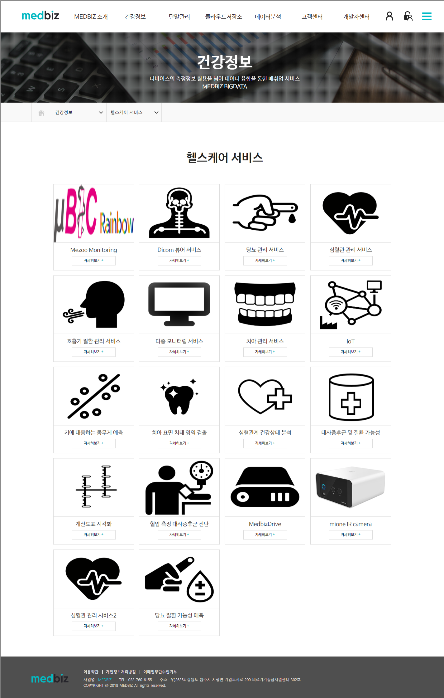
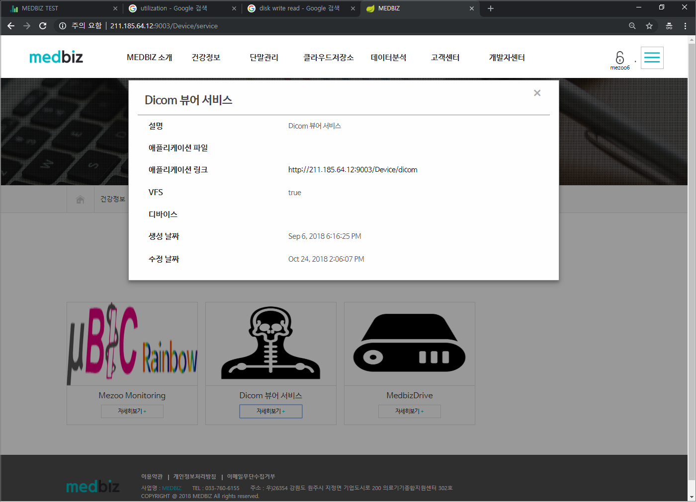
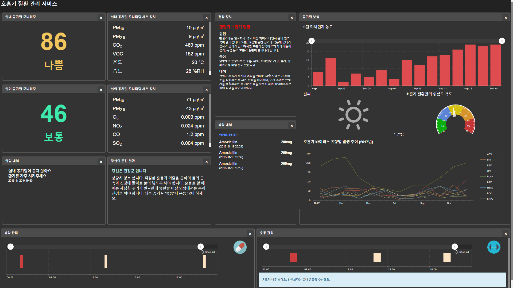
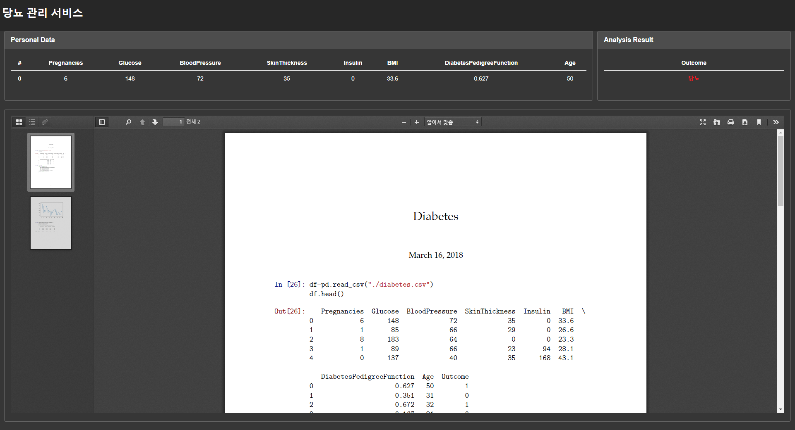
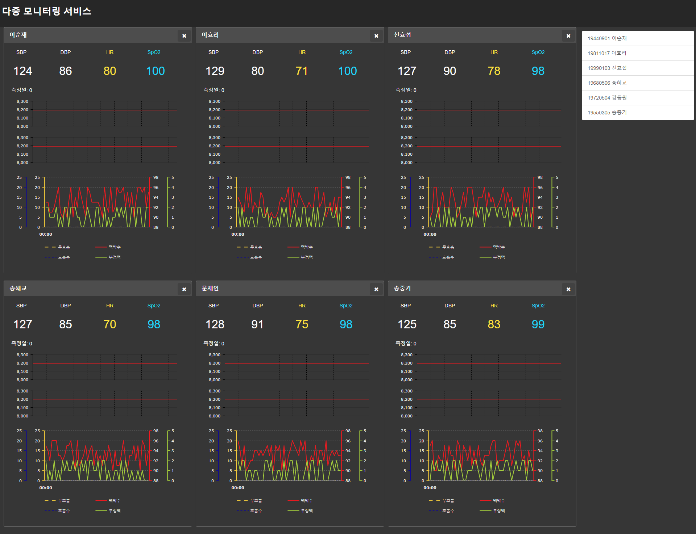
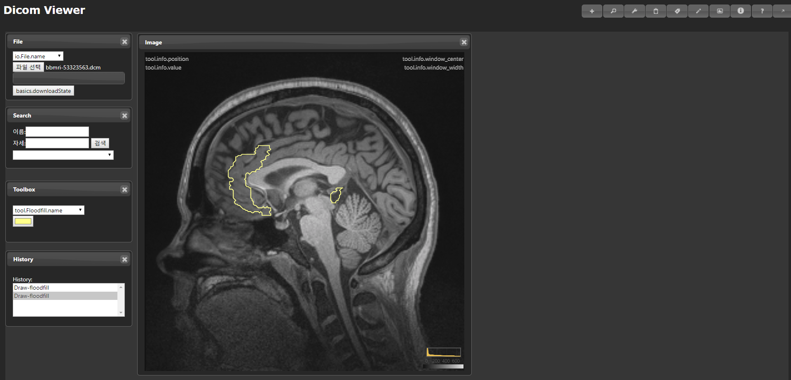
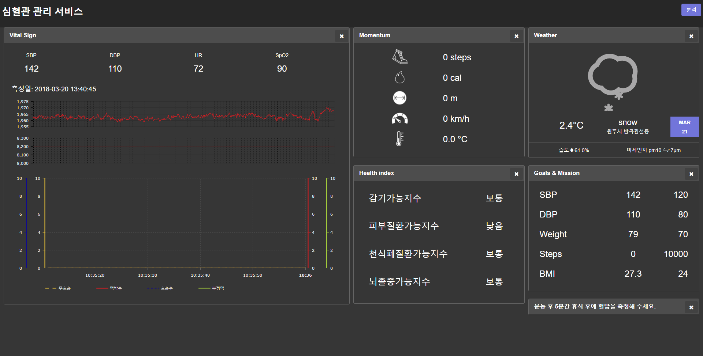

헬스케어 서비스
==================

.. contents:: 목차

헬스케어 서비스 - 위치
---------------------------

홈페이지의 "건강정보 > 헬스케어 서비스" 메뉴에서 등록한 단말에 관련된 서비스가 표시됩니다. 이러한 서비스로는 Dicom 뷰어 서비스, 당뇨 관리 서비스, 심혈관 관리 서비스, 호흡기 질환 관리 서비스 등이 있습니다.

* 보유한 단말 또는 VFS 사용 여부에 따라 관련 서비스 제공

  [그림 1] 헬스케어 서비스 리스트 예시

헬스케어 서비스 - 자세히보기
--------------------------------

각 서비스 항목에 있는 '자세히보기' 버튼을 누르면 애플리케이션 링크를 확인할 수 있습니다. 이 애플리케이션 링크를 클릭하여 해당 서비스를 이용할 수 있습니다.

* 자세히 보기
   - 서비스 상세 정보 확인 및 첨부 파일 다운이나 애플리케이션 링크 제공

  [그림 2] Dicom 뷰어 서비스의 자세히보기 창

호흡기 질환 관리 서비스
------------------------

* 호흡기 질환에 취약한 위험 군(노인, 어린이 등)과 호흡기 질환 보유 환자의 건강 상태를 분석하고 질환 예방 및 관리의 위협 요인인 공기 질을 실시간으로 모니터링하며, 개인 상태 및 상황 별에 적합한 건강 관리 서비스 입니다.

* 사용자 별 정밀 서비스를 위해 모바일 앱을 통한 사전 문진으로 사용자 별 최적화된 서비스를 제공합니다.

* 제공하는 환자 맞춤 정보의 종류는 다음과 같습니다.
   - 실내 공기 질 모니터링
   - 실내 공기 질 모니터링 세부 정보
   - 실외 공기 질 모니터링
   - 실외 공기 질 모니터링 세부 정보
   - 알림 내역
   - 문진 결과
   - 건강 정보
   - 복약 내역
   - 공기 질 분석

* 공기 질 측정 디바이스 연동뿐만 아니라 호흡기 질환 진단 의료기기와 연동하여 다양한 사용자 맞춤 의료 정보 서비스를 제공합니다.실시간 기상데이터 및 사용자 정보를 바탕으로 환자의 상태를 분석 프로그래밍을 통해 정밀 분석하고 사용자 알맞은 정보를 서비스합니다.

  [그림 1] 호흡기 질환 관리 서비스

당뇨 관리 서비스
------------------------

* 당뇨의 관리는 당뇨병성 합병증을 예방하는데 필수로 MEDBIZ는 나이, 당뇨병의 종류, 당뇨병 유형기간, 생황 습관, 건강 상태, 혈당 조절의 정도 등을 분석하여 개개인에 맞는 최적의 관리 서비스를 제공합니다.

* Glucose, BloodPressure SkinThickness Insulin, BMI, DiabetesPedigreeFunction, Age 사용자 정보를 바탕으로 당뇨를 정밀 분석합니다.

* 분석된 데이터는 사용자 친화적인 GUI를 통해 환자 개인의 당뇨 관리를 도와 줍니다.

  [그림 2] 당뇨 관리 서비스

다중 모니터링 서비스
------------------------

* MEDBIZ는 다수의 디바이스에서 나오는 데이터를 각각의 구성원과 연결하여 데이터를 실시간으로 모니터링 가능합니다. 또한 다수의 사용자의 정보를 한 화면에서 모니터링 가능합니다.

  [그림 3] 다중 모니터링 서비스

DICOM 뷰어 서비스
------------------------

* 의료용 디지털 영상 및 통신 표준을 준수 하는 의료 데이터 파일인 DICOM(Digital Imaging and Communications in Medicine) 파일을 웹에서 확인할 수 있는 서비스를 제공합니다.

* DICOM 파일 데이터를 분석 프로그래밍에 의해 분석하고, 분석된 이미지를 디스플레이 합니다.

* DICOM 파일의 METADATA를 분류하여 관리하여 데이터 파일의 관리와 사용에 최적화된 성능을 제공합니다.

  [그림 4] DICOM 뷰어 서비스

심혈관 질환 관리 서비스
------------------------

* 사용자의 생체 신호(SpO2, 혈압, 심박수, 심전도), 움직임 정도, 기상 데이터를 종합하여 정상 데이터와 비교 분석하고 심혈관 질환 예방을 위한 정보를 제공합니다.

* 건강 지수를 활용한 감기, 피부 질환, 천식폐질환가능지수, 뇌졸증 가능 지수를 제공합니다.

* 지역에 기반한 현재 기상 상태를 제공합니다.

* 사용자 개인의 목표를 설정하고, 해당 목표 달성을 위해 남은 수치를 표시해 줍니다.

  [그림 5] 심혈관 질환 관리 서비스
