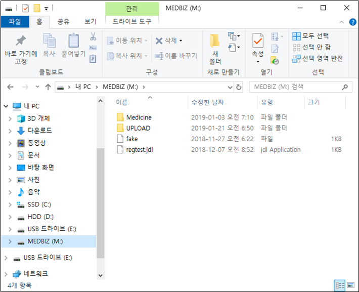
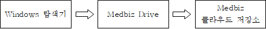
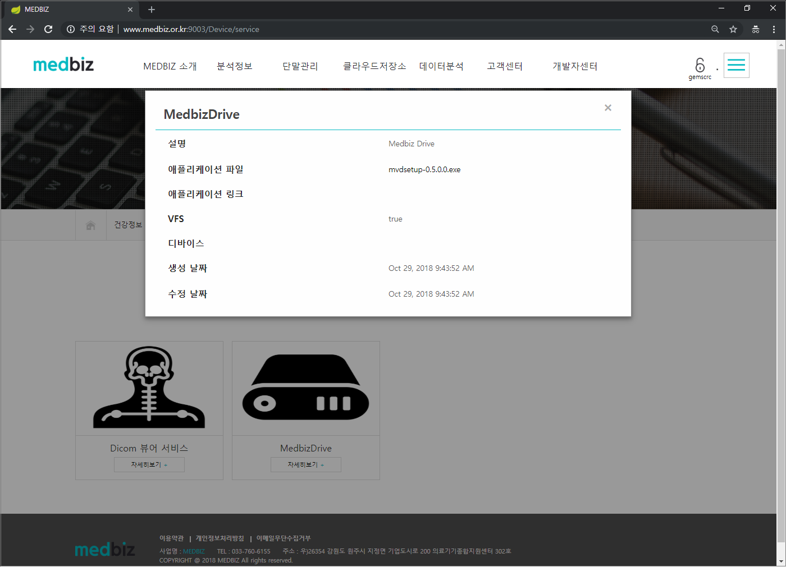
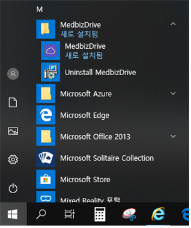
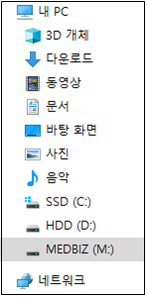
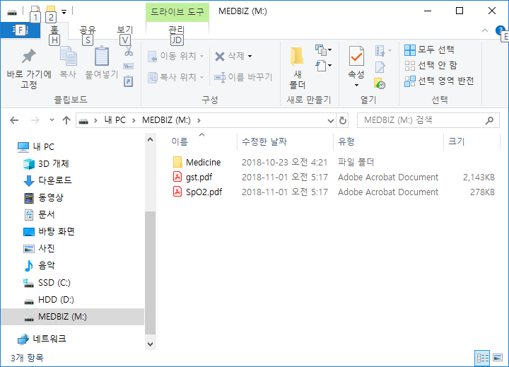
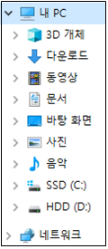

Medbiz Drive
=============

.. contents:: 목차

Medbiz Drive 개요
-----------------------

Medbiz Drive는 Medbiz 클라우드 저장소에 접근할 수 있는 가상 드라이브를 Windows 운영체제에 생성하는 프로그램이다. 

생성되는 가상 드라이브는 M 드라이브이고, 볼륨 레이블은 ‘MEDBIZ’다.

* 가상 드라이브 문자 : M (M 드라이브가 생성됨)
* 가상 드라이브 볼륨 레이블 : MEDBIZ

  < Windows 탐색기에서 보이는 Medbiz Drive >

생성된 M 드라이브는 Windows 파일 관리 프로그램인 Windows 탐색기를 통하여 접근할 수 있다. 

사용자는 Windows 탐색기에서 파일과 폴더를 관리하는 방식 그대로 Medbiz 클라우드 저장소의 파일과 폴더를 관리할 수 있다. 

예를 들어, 사용자가 임의의 파일을 M 드라이브로 복사하면, 해당 파일은 실제로 Medbiz 클라우드 저장소로 업로드된다.

  < 파일 업로드 흐름 >

Medbiz Drive 프로그램 다운로드
----------------------------------

Medbiz 홈페이지에서 Medbiz Drive 프로그램을 다운로드 할 수 있다. 아래에 다운로드 위치에서 Medbiz Drive 애플리케이션 파일을 다운로드 한다.

○ 다운로드 위치 : “분석정보 > 헬스케어 서비스> MedbizDrive > 자세히보기+”

  < Medbiz Drive 프로그램 다운로드 >

Medbiz Drive 설치
-----------------------

다운로드한 Medbiz Drive 설치 파일을 실행하여 설치한다. 설치를 성공하면, Windows 메뉴에는 MedbizDrive 프로그램 그룹이 생성되고, 바탕화면에는 MedbizDrive 바로 가기가 생성되며, 제어판 ‘프로그램 추가/제거‘에는 MedbizDrive 항목이 생성된다.

Medbiz Drive 설치 과정에서 Dokan 디바이스 드라이버와 닷넷 프레임워크(.NET Framework)가 함께 설치된다.

* Medbiz Drive와 함께 설치되는 프로그램 (2019년 1월 기준)
   - Dokan v1.2.1.1000
   - .NET Framework 4.6.1

|medbiz_drive_login_window|  ▶ |medbiz_drive_program_group|

Medbiz Drive 실행
-----------------------

|medbiz_drive_icon| MedbizDrive 프로그램을 실행하면 로그인 화면이 나온다.

  < Medbiz Drive 로그인 창 >

Medbiz Drive 로그인
-------------------------

아이디와 비밀번호를 입력하고 로그인 버튼을 클릭하여 로그인을 시도한다. 로그인을 성공하면, ‘MEDBIZ’라는 볼륨 레이블의 M 드라이브가 생성되며, Windows 탐색기에서 M 드라이브를 확인할 수 있다. 또한, 로그인 버튼은 로그아웃 버튼으로 변경된다.

종종 로그인을 성공했는데도 로그인을 성공했는데도 Windows 탐색기에는 M 드라이브가 보이지 않을 때가 있다. 이럴 땐 Windows 탐색기에서 F5 키를 눌러 ‘새로 고침‘ 기능을 수행하면, M 드라이브가 나타난다.

.. note::
  
  Medbiz Drive는 가상 드라이브로 M 드라이브를 생성한다. 그러므로, 기존에 다른 가상 드라이브 프로그램에서 M 드라이브를 사용하고 있다면, 먼저 M 드라이브를 제거하거나 다른 드라이브 문자로 변경해야 한다. 또한, 하드 디스크 드라이브, USB 드라이브, DVD 드라이브, 네트워크 드라이브 등에서 M 드라이브를 먼저 사용하고 있다면, 다른 드라이브로 변경해야 한다.

|medbiz_drive_logined| ▶ |medbiz_drive_mounted_in_explorer|

Windows 탐색기를 통한 클라우드 저장소 파일 관리
---------------------------------------------------

Windows 탐색기를 통하여 M 드라이브에 보이는 파일이나 폴더는 실제로 클라우드 저장소에 있는 파일이나 폴더가 그대로 보여지는 것이다.

Windows 탐색기를 통하여 M 드라이브에서 수행되는 파일 처리 연산은 실제로 클라우드 저장소에도 반영된다. C 드라이브에서 M 드라이브로 파일을 복사하면, 해당 파일은 클라우드 저장소로 업로드된다. 마찬가지로, M 드라이브에서 다른 드라이브로 파일을 복사하면, 해당 파일은 클라우드 저장소로부터 다운로드된다.

또한, Windows 탐색기를 통하여 M 드라이브에서 수행되는 폴더 관련 연산도 실제로 클라우드 저장소에 반영된다. M 드라이브에서 폴더를 만들면, 클라우드 저장소에도 해당 폴더가 만들어진다. 마찬가지로, M 드라이브에서 폴더를 삭제하면, 클라우드 저장소에도 해당 폴더가 삭제된다.

  < Windows 탐색기를 통한 클라우드 저장소 파일 관리 >

Medbiz Drive 로그아웃
-------------------------

Medbiz Drive 프로그램에서 로그아웃 버튼을 클릭하면, 가상 드라이브인 M 드라이브는 제거되고, 클라우드 저장소는 로그아웃된다.

|medbiz_drive_logouted| ▶ |medbiz_drive_unmounted_in_explorer|

Medbiz Drive Cache
-------------------------

Medbiz Drive는 하드 디스크 드라이브의 특정 폴더를 캐시로 사용한다. 그러므로 캐시로 사용되는 하드 디스크 드라이브에는 적어도 Medbiz 클라우드 저장소 할당 용량 만큼의 여유 용량이 있어야 한다. 

Medbiz 클라우드 저장소 할당 용량은 기본적으로 1GB이다. 일반적으로 Windows 운영체제가 설치되는 C 드라이브가 캐시로 사용되게 되며, 여기에 최소 1GB 이상의 여유 용량이 있어야 한다.

캐시 폴더는 Medbiz Drive 프로그램을 로그인/로그아웃할 때 삭제되므로 사용자는 별도로 신경쓰지 않아도 된다.

* Medbiz Drive가 사용하는 Cache 폴더의 위치: :code:`C:\Users\<Windows사용자ID>\.mvd\<Medbiz사용자ID>`

Medbiz Drive 명령행 옵션
-------------------------------

.. code:: console

  Usage: mvdgwin [OPTIONS]
  Options:
    -u, --userid=VALUE         User identification
    -p, --passwd=VALUE         Password
    -t, --type=VALUE           User type: General user(0), Vendor(1)

* Medbiz Drive 메인 실행 파일인 mvdgwin.exe 파일의 명령행 옵션을 사용하면,
  프로그램이 시작하자마자 바로 로그인을 수행하게 할 수 있다.

   - mvdgwin -u myUserID -p myPassword
      + 일반 사용자로 로그인
   - mvdgwin -u myUserID -p myPassword -t 0
      + 일반 사용자로 로그인 (위와 동일)
   - mvdgwin -u myUserID -p myPassword -t 1
      + 기업 사용자로 로그인
