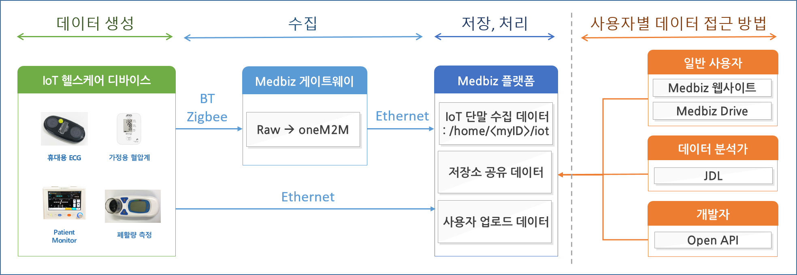

.. contents:: 목차

.. tip::
    MEDBIZ 플랫폼에 디바이스 데이터를 전송하기위해서는 제품, Manifest, 디바이스 등록을 먼저 `수행 <https://medbiz-user-guide.readthe
    docs.io/ko/latest/product.html>`_ 해야합니다.

    등록된 디바이스의 DeviceMuid와 DeviceSecret을 이용하여 oneM2M 표준을 이용하여 데이터를 전송/조회합니다.

oneM2M (HTTP)
==============
디바이스에서 생성된 데이터를 oneM2M 표준을 이용하여 저장/조회하는 기능을 소개합니다.

개요
-------------

MEDBIZ Platform에서는 디바이스 데이터를 관리하기 위해 데이터 표준으로 oneM2M을 사용합니다. 해당 표준을 이용하여 데이터를 수집하고
조회 및 삭제를 할 수 있는 API를 제공합니다. 보다 더 구체적인 표준 명세를 확인 하기위해서는 `이곳 <https://www.onem2m.org/technical
/published-specifications/release-3>`_ 을 참조합니다.

데이터 생성
-------------

.. table::
  :widths: auto

  =========================  =================================================================
  내용
  =========================  =================================================================
  HTTP Request Method        POST
  -------------------------  -----------------------------------------------------------------
  HTTP Request URL           :code:`https://onem2m.medbiz.or.kr/Mobius/<Device_ID>/fields/<field>`
  -------------------------  -----------------------------------------------------------------
  Header                     .. code:: json

                                     {
                                       "Accept" : "application/json",
                                       "X-M2M-Origin" : "<Device_SECRET>",
                                       "Content-Type" : "application/json;ty=4",
                                       "X-M2M-RI" : "<Resource Identifier>"
                                     }

  -------------------------  -----------------------------------------------------------------
  Body                       .. code:: json

                                     {
                                       "m2m:cin": {
                                         "con": 27.00
                                       }
                                     }

  -------------------------  -----------------------------------------------------------------
  Response                   .. code:: json

                                     {
                                       "m2m:cin": {
                                         "rn": "4-20180919070519631uP5z",
                                         "ty": 4,
                                         "pi": "{parentID}",
                                         "ri": "{resourceID}",
                                         "ct": "20180919T070519",
                                         "et": "20210919T070519",
                                         "lt": "20180919T070519",
                                         "st": 0,
                                         "cs": 2,
                                         "con": "27",
                                         "cr": "S20170717074825768bp2l"
                                       }
                                     }

  =========================  =================================================================

파라미터 설명

- <Device_ID> : 디바이스 MUID 값을 대입
- <Device_SECRET> : 디바이스 Token 값을 대입
- <Resource Identifier> : 리소스 ID 요청하는 값에 대해 응답에 해당값을 포함시켜줌 (비동기 요청에서 동일한 요청-응답 확인을 위함) HTTP 사용시 8자 이하의 ASCII 문자 권장
- <field> : manifest에 등록되어있는 디바이스 필드 값 (디바이스 생성시 생성되어있음)

데이터 조회
------------

최근 1건
^^^^^^^^^

.. table::
  :widths: auto

  =========================  =================================================================
  내용
  =========================  =================================================================
  HTTP Request Method        GET
  -------------------------  -----------------------------------------------------------------
  HTTP Request URL           :code:`https://onem2m.medbiz.or.kr/Mobius/<Device_ID>/fields/<field>/latest`
  -------------------------  -----------------------------------------------------------------
  Header                     .. code:: json

                                     {
                                       "Accept" : "application/json",
                                       "X-M2M-Origin" : "<Device_SECRET>"
                                       "X-M2M-RI" : "<Resource Identifier>"
                                     }

  -------------------------  -----------------------------------------------------------------
  Response                   .. code:: json

                                 {
                                   "m2m:cin": {
                                     "rn": "4-20180919070519631uP5z",
                                     "ty": 4,
                                     "pi": "{parentID}",
                                     "ri": "{resourceID}",
                                     "ct": "20180919T070519",
                                     "et": "20210919T070519",
                                     "lt": "20180919T070519",
                                     "st": 0,
                                     "cs": 2,
                                     "con": "27",
                                     "cr": "S20170717074825768bp2l"
                                   }
                                 }

  =========================  =================================================================

기간 검색
^^^^^^^^^

.. table::
  :widths: auto

  =========================  =================================================================
  내용
  =========================  =================================================================
  HTTP Request Method        GET
  -------------------------  -----------------------------------------------------------------
  HTTP Request URL           :code:`https://onem2m.medbiz.or.kr/Mobius/<Device_ID>/fields/<field>`
  -------------------------  -----------------------------------------------------------------
  Header                     .. code:: json

                                     {
                                       "Accept" : "application/json",
                                       "X-M2M-Origin" : "<Device_SECRET>"
                                       "X-M2M-RI" : "<Resource Identifier>"
                                     }

  -------------------------  -----------------------------------------------------------------
  Params
                               - **rcn**
                               쿼리 범위
                               하위 리소스 이므로 4 로 명시

                               - **ty**
                               resource type
                               content instance (생성한 데이터) 이므로 4 로 명시

                               - **cra**
                               created after
                               생성 조회 시작일 UTC 시간임을 유의
                               20191112T000000

                               - **crb**
                               created before
                               생성 조회 마감일 UTC 시간임을 유의
                               20191120T235959

  -------------------------  -----------------------------------------------------------------
  Response                   .. code:: json

                                 {
                                  "m2m:rsp": {
                                    "m2m:cin": {
                                      "rn": "4-20180919070519631uP5z",
                                      "ty": 4,
                                      "pi": "{parentID}",
                                      "ri": "{resourceID}",
                                      "ct": "20180919T070519",
                                      "et": "20210919T070519",
                                      "lt": "20180919T070519",
                                      "st": 0,
                                      "cs": 2,
                                      "con": "27",
                                      "cr": "S20170717074825768bp2l"
                                    }
                                  }
                                }

  =========================  =================================================================

참고 문서 또는 사이트
--------------------------

.. table::
 :widths: auto

 =========  ===================================================================
 자료명       관련 참조
 ---------  -------------------------------------------------------------------
 oneM2M     http://www.onem2m.org/application-developer-guide/architecture
 =========  ===================================================================

사용자별 데이터 접근 방법
==========================

사용자별 데이터 접근 방법

데이터 생성/수집
--------------------------

사용자가 Medbiz 플랫폼과 연동 가능한 IoT 헬스케어 단말을 구매하고, 단말을 Medbiz 플랫폼에 등록할 수 있다.

단말을 등록하려면, 단말이 이더넷을 통해 Medbiz 플랫폼에 접근가능해야 한다.

단말이 Medbiz 플랫폼에 등록된 후, 사용자가 등록된 단말을 사용하면, 해당 단말이 **생성** 하는 센싱/측정 데이터는 Medbiz 플랫폼으로 전달되어 **수집** 된다.

단말이 Medbiz 플랫폼과 연동가능한 oneM2M 프로토콜을 지원하면, Medbiz 플랫폼으로 직접 연결하여 데이터를 전달할 수 있다. 그렇지 않고, 단말이 Bluetooth, Zigbee 등의 무선 통신을 지원하면, Medbiz 게이트웨이를 거쳐서 Medbiz 플랫폼으로 데이터를 전달할 수 있다.

데이터 저장/업로드/공유
--------------------------

Medbiz 플랫폼은 IoT 단말로 부터 수집된 데이터를 파일 형태로 **저장** 한다. 또한, 사용자가 직접 Medbiz 플랫폼에 데이터를 **업로드** 할 수도 있다. 뿐만 아니라, 자신의 데이터를 디렉터리 단위로 다른 사용자에게 **공유** 할 수도 있다.

데이터 파일 사용 방법
--------------------------

Medbiz 플랫폼에 저장된 데이터는 데이터 분석가, 개발자, 일반 사용자 등이 접근할 수 있다.

**데이터 분석가** 는 JDL(Job Description Language) 파일에 데이터 파일의 위치를 지정함으로써 데이터 파일을 사용할 수 있다. 자세한 내용은 `데이터 분석 스크립트 구동 방법 <analysis.html>`_ 문서를 참고한다.

**개발자** 는 Medbiz 플랫폼에서 제공하는 Open API 를 사용하여 데이터 파일에 접근할 수 있다. 자세한 내용은 `플랫폼 연동 가이드 <../platform_link_guide.html>`_ 문서를 참고한다.

**일반 사용자** 는 Medbiz 웹사이트의 클라우드 저장소 기능을 통해 데이터 파일에 접근할 수 있다. 자세한 내용은 `클라우드 저장소 <cloud_storage_using_guide.html>`_ 문서를 참고한다. 또한, Medbiz Drive 라는 별도의 PC용 프로그램을 통하여 데이터 파일에 접근할 수도 있다. 자세한 내용은 `Medbiz Drive <medbiz_drive_using_guide.html>`_ 문서를 참고한다.

헬스케어 서비스 이용
--------------------------

사용자가 Medbiz 플랫폼에 IoT 헬스케어 단말을 등록하면, Medbiz 웹사이트 제공하는 등록한 단말과 관련된 헬스케어 서비스를 이용할 수 있다. 이 헬스케어 서비스는 등록된 단말에서 Medbiz 플랫폼으로 업로드하는 데이터를 기반으로 서비스된다. 자세한 내용은 `헬스케어 서비스 <medbiz_healthcare_service/using_healthcare_service.html>`_ 문서를 참고한다.

