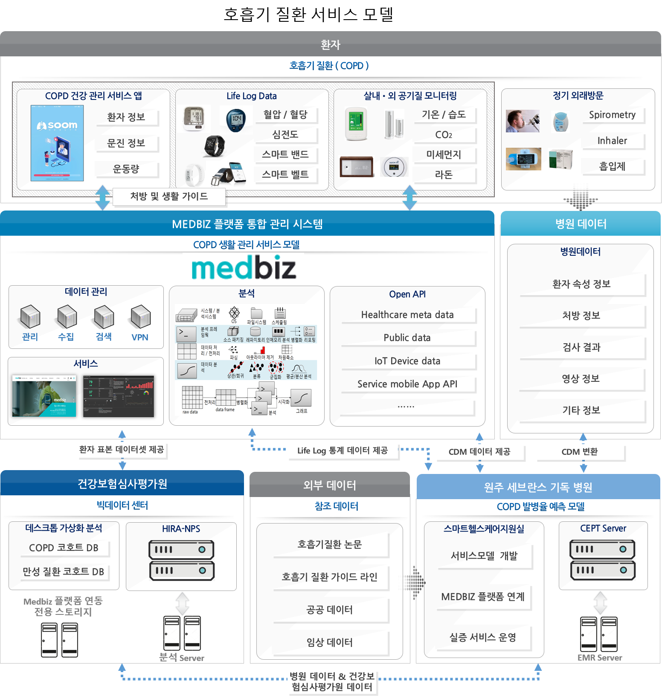

.. contents:: 목차

------------------------------------
대사증후군 당뇨 예방 실증 서비스
------------------------------------

--------------------------------------
만성 폐쇄성폐질환 건강관리 실증 서비스
--------------------------------------

------------------------------------
심전도 모니터링 실증 서비스
------------------------------------

------------------------------------
독거 노인 관리 서비스 예시
------------------------------------

------------------------------------
영유아 감시 서비스
------------------------------------

.. figure:: static/example_infant_monitoring_service.png