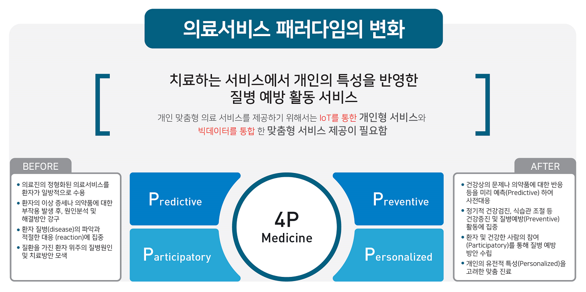
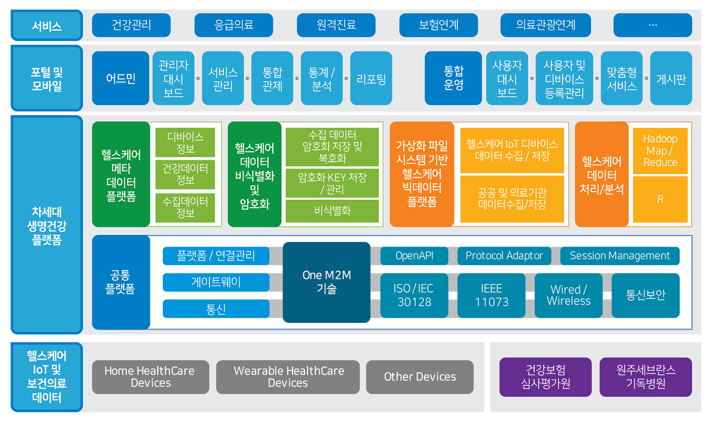
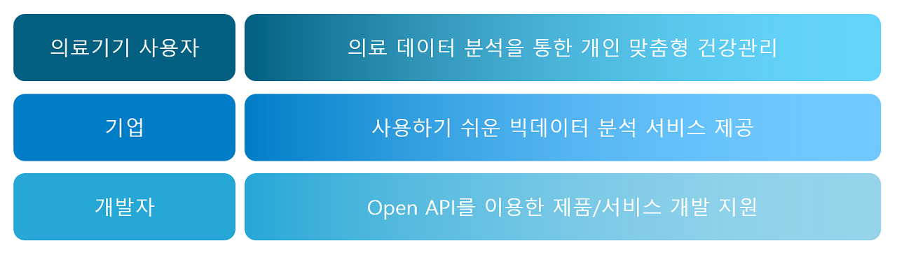
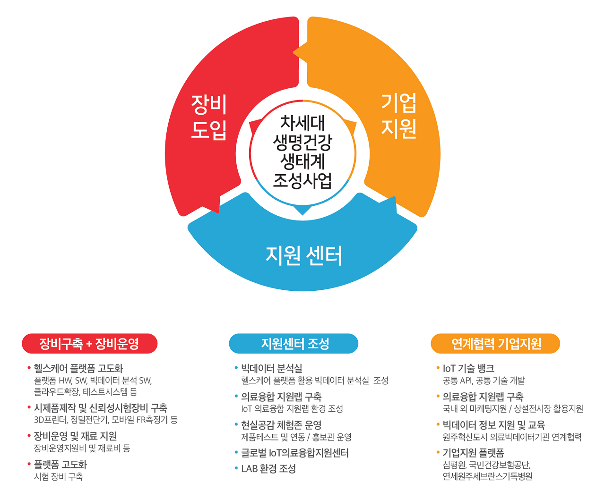

========
MEDBIZ Platform
========

---------
소개
---------

행복한 삶을 위해서는 건강이 무엇보다도 중요합니다. 질병 발생 전에 미리 예측하고, 건강한 몸을 유지하도록 예방할 수 있다면 더 없이 좋을 것입니다.

지금까지는 치료 중심의 의료 서비스가 발전되어 왔습니다.

이제는 의료기기와 IT 기술의 융합으로 개인의 특성을 반영한 예방 중심의 의료 서비스로 패러다임이 변화하고 있습니다.

-------------------------------
Medbiz 헬스케어 플랫폼
-------------------------------

MEDBIZ 헬스케어 플랫폼은 개인과 기업을 위한 IoT 빅데이터 헬스케어 플랫폼입니다. 기존 IoT 플랫폼과 의료정보 클라우드 및 빅데이터 플랫폼을 통합하는 시스템입니다.

헬스케어 IoT 디바이스 연동, 외부 의료 데이터 연계 등을 통해 의료 데이터를 수집하고, 클라우드 저장소에 저장합니다. 이를 기반으로 일반 사용자 및 전문가를 위한 의료정보 빅데이터 분석 서비스를 제공합니다.

뿐만 아니라 Open API를 제공하여 특화된 서비스를 개발할 수 있도록 지원합니다.

-------------------------------
Medbiz 헬스케어 플랫폼의 활용
-------------------------------

헬스케어 IoT 디바이스를 사용하면 할수록 클라우드 저장소에 의료 데이터가 쌓이게 됩니다.

* 헬스케어 IoT 디바이스 사용자는 의료 데이터가 쌓일수록 더 정확한 건강관리 서비스를 받을 수 있습니다.
* 기업은 사용하기 어려운 빅데이터 분석 장비와 서비스를 도입하지 않아도 양질의 분석 서비스를 이용할 수 있습니다.
* 또한, 공개된 Open API를 이용하여 특화된 제품 및 매쉬업 서비스를 개발할 수 있습니다.

-------------------------------
차세대 생명건강 생태계 조성
-------------------------------

MEDBIZ 헬스케어 플랫폼은 의료기기 기업들이 자사의 의료기기에 IoT 기술과 빅데이터 분석 기술을 활용하여 경쟁력을 높일 수 있도록 지원합니다. 장비 구축 및 운영 지원, 지원센터 조성 지원, 연계협력 기업지원 등에 활용되면서 차세대 생명건강 생태계 조성에 기여하고 있습니다.

-------------------------------
모델별 MEDBIZ 플랫폼 활용
-------------------------------

.. image:: _static/medbiz_function_arch.jpg

MEDBIZ 플랫폼을통해 개발한 제품의 IoT 클라우드 연동, 파일데이터들의 관리, 수집된 데이터의 분석을 수행할 수 있습니다.

각 기업의 필요에 따라 아래 기능들을 통해 연동을 할 수 있습니다.

MODEL1. oneM2M을 이용하여 플랫폼에 디바이스의 데이터를 전송하고 모니터링

MODEL2. 가상파일시스템을 활용하여 플랫폼에 업로드하여 관리하거나 서비스 개발에 활용

MODEL3. 가상파일시스템에 저장된 파일을 활용하여 분석하고 시각화를 하는데 활용

플랫폼에 대한 보다 자세한 정보는 `MEDBIZ 플랫폼 소개 <https://medbiz.or.kr/contents/view?topMenuNo=1&contentsNo=1&levl=2&menuNo=10>`_ 에서 확인하실 수 있습니다.