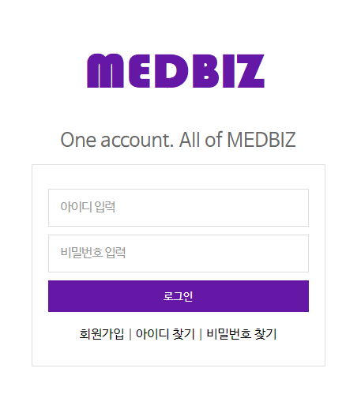
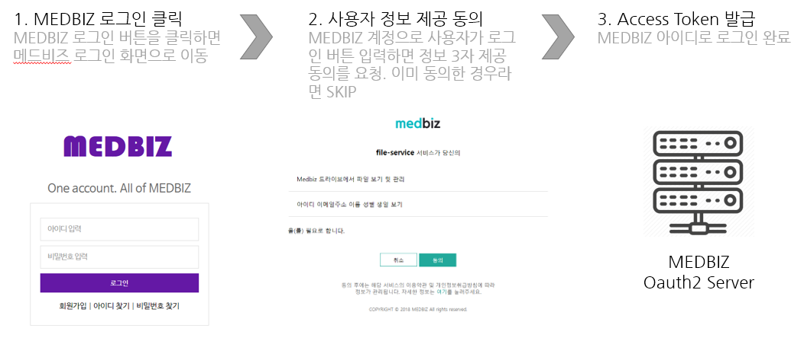

=============
MEDBIZ 로그인
=============

* `개요`_
* `API 명세`_
* `MEDBIZ 회원 프로필 조회 API 명세`_

---------
개요
---------
MEDBIZ 로그인은 Oauth2.0 기반의 사용자 인증 기능을 제공해 MEDBIZ의 사용자 인증 기능을 이용할 수 있게 하는 서비스입니다.

MEDBIZ 아이디로 로그인을 통해 로그인하는 기본 절차는 다음과 같습니다.

1. 주요 기능

- MEDBIZ의 다양한 오픈 API를 통한 메시업
  
  MEDBIZ 아이도로 로그인을 활용해 오픈 API로 제공되는 MEDBIZ 서비스를 이용할 수 있습니다. MEDBIZ 아이디로 로그인한 
  사용자가 어플리케이션에서 MEDBIZ VFS(참조)로 파일을 업로드/다운로드 하거나 MEDBIZ에 등록된 디바이스(참조)에 접근할
  수 있습니다. MEDBIZ 로그인을 통해 이용할 수 있는 오픈 API는 계속 추가될 예정입니다. 오픈 API에 대한 자세한 내용은
  아래 API 사용 가이드(참조)를 확인하세요.

2. 적용 절차

MEDBIZ 로그인은 다음과 같은 절차를 통해 서비스에 적용할 수 있습니다.

2-1. OauthClient 등록

MEDBIZ 아이디로 로그인을 적용하기 위해 OauthClient를 등록하고 클라이언트 아이디와 클라이언트 시크릿을 발급받습니다.
<등록 방법 보기>

2-2. 어플리케이션 개발

MEDBIZ 아이디로 로그인을 이용하기 위한 정보를 확인하고 등록한 환경에 맞는 개발가이드를 참고해 애플리케이션을 개발합니다.
<개발 가이드>

2-3. 서비스 적용

개발을 완료하면 MEDBIZ 아이디 로그인을 적용합니다.

3. 기타

- `oauth2.0 <https://oauth.net/>`_

---------
API 명세
---------
'MEDBIZ 아이디로 로그인 API는 MEDBIZ 로그인 인증 요청 API, 접근 토큰 발급/갱신/삭제 요청API로 구성되어 있습니다. 
MEDBIZ 로그인 인증 요청 API는 여러분의 웹 또는 앱에 MEDBIZ 로그인 화면을 띄우는 API입니다. 이용자가 MEDBIZ 회원 인증에 
성공하면 API로부터 받은 code 값을 이용해서 접근 토큰 발급 요청 API를 호출합니다. 접근 토큰 발급 요청 API를 통해 받은 
접근 토큰(access token) 값은 다음과 같이 회원 프로필 조회를 비롯하여 MEDBIZ에서 제공하는 오픈 API를 호출하는데 사용할 수 
있습니다.

1. 준비사항

- OauthClient 등록: MEDBIZ 오픈 API로 개발하시려면 먼저 OauthClient를 등록하셔야 합니다.
  <등록 방법 보기>
  
- 클라이언트 ID와 secret 확인: '내 OauthClient'에서 등록한 OauthClient를 선택하면 Client ID와 Client Secret 값을 확인할 수 있습니다.

2. API 정보

===========  ==========  ============================================  ===============  ==================================
 메서드	        인증                  요청 URL                            출력 포맷             설명
===========  ==========  ============================================  ===============  ==================================
GET / POST    OAuth 2.0    https://auth.medbiz.or.kr/oauth/authorize    URL 리다이렉트      MEDBIZ 아이디로 로그인 인증 요청
GET / POST    OAuth 2.0    https://auth.medbiz.or.kr/oauth/token        json	              접근 토큰 발급/갱신/삭제 요청
===========  ==========  ============================================  ===============  ==================================

3. 요청 변수

3.1. MEDBIZ 아이디로 로그인 인증 요청

==============  ========  ============  ======  ========================================================================================================================================
요청 변수명        타입    필수 여부    기본값     설명
==============  ========  ============  ======  ========================================================================================================================================
response_type    string    Y            code    인증 과정에 대한 내부 구분값으로 'code'로 전송해야 함
client_id        string    Y            -       애플리케이션 등록 시 발급받은 Client ID 값
redirect_uri     string    Y            -       애플리케이션을 등록 시 입력한 Callback URL 값으로 URL 인코딩을 적용한 값
state            string    Y            -       사이트 간 요청 위조(cross-site request forgery) 공격을 방지하기 위해 애플리케이션에서 생성한 상태 토큰값으로 URL 인코딩을 적용한 값을 사용
scope            string    N            -       접근 허용 범위를 처리하기 위한 내부 구분값으로 전송할 필요 없음
==============  ========  ============  ======  ========================================================================================================================================

3.2. 접근 토큰 발급/갱신/삭제 요청

- 로그아웃
MEDBIZ 로그아웃에 대한 별도의 api가 없으며 사용자가 직접 MEDBIZ 서비스에서 로그아웃 하도록 처리하셔야 합니다.
이유는 이용자 보호를 위해 정책상 MEDBIZ 이외의 서비스에서 MEDBIZ 로그아웃을 수행하는 것을 허용하지 않고 있는 점 양해 부탁드립니다. 

============== ========  ==============  =======    ======================================================================================
요청 변수명       타입       필수 여부      기본값           설명
============== ========  ==============  =======    ======================================================================================
grant_type      string      Y              -            인증 과정에 대한 구분값
                                                     1) 발급:'authorization_code'
                                                     2) 갱신:'refresh_token'
client_id       string      Y              -            애플리케이션 등록 시 발급받은 Client ID 값
client_secret   string      Y              -            애플리케이션 등록 시 발급받은 Client secret 값
code            string    발급 때 필수      -            로그인 인증 요청 API 호출에 성공하고 리턴받은 인증코드값 (authorization code)
refresh_token   string    갱신 때 필수      -            MEDBIZ 사용자 인증에 성공하고 발급받은 갱신 토큰(refresh token)
access_token    string    삭제 때 필수      -            기 발급받은 접근 토큰으로 URL 인코딩을 적용한 값을 사용
============== ========  ==============  =======    ======================================================================================

4. 출력 결과

4.1. MEDBIZ 아이디로 로그인 인증 요청

MEDBIZ 아이디로 로그인 인증 요청 API를 호출했을 때 사용자가 MEDBIZ로 로그인하지 않은 상태이면 MEDBIZ 로그인 화면으로 이동하고, 사용자가 MEDBIZ에 로그인한 상태이면 기본 정보 제공 동의 확인 화면으로 이동합니다. 
MEDBIZ 로그인과 정보 제공 동의 과정이 완료되면 콜백 URL에 code값과 state 값이 URL 문자열로 전송됩니다. code 값은 접근 토큰 발급 요청에 사용합니다. API 요청 실패시에는 에러 코드와 에러 메시지가 전송됩니다.
API 요청 성공시 : http://콜백URL/redirect?code={code값}&state={state값}
API 요청 실패시 : http://콜백URL/redirect?state={state값}&error={에러코드값}&error_description={에러메시지}

=================  ========  ======================================================================================
필드                   타입             설명
=================  ========  ======================================================================================
code                string    MEDBIZ 아이디로 로그인 인증에 성공하면 반환받는 인증 코드, 접근 토큰(access token) 발급에 사용
state               string    사이트 간 요청 위조 공격을 방지하기 위해 애플리케이션에서 생성한 상태 토큰으로 URL 인코딩을 적용한 값
error               string    MEDBIZ 아이디로 로그인 인증에 실패하면 반환받는 에러 코드
error_description   string    MEDBIZ 아이디로 로그인 인증에 실패하면 반환받는 에러 메시지
=================  ========  ======================================================================================

4.2. 접근 토큰 발급 요청

=================  ========  ======================================================================================
필드                   타입             설명
=================  ========  ======================================================================================
access_token        string      접근 토큰, 발급 후 expires_in 파라미터에 설정된 시간(초)이 지나면 만료됨
refresh_token       string      갱신 토큰, 접근 토큰이 만료될 경우 접근 토큰을 다시 발급받을 때 사용
token_type          string      접근 토큰의 타입으로 Bearer와 MAC의 두 가지를 지원
expires_in          integer      접근 토큰의 유효 기간(초 단위)
error               string      에러 코드
error_description   string      에러 메시지
=================  ========  ======================================================================================

4.3. 접근 토큰 갱신 요청

=================  ========  ======================================================================================
필드                  타입             설명
=================  ========  ======================================================================================
access_token        string    접근 토큰, 발급 후 expires_in 파라미터에 설정된 시간(초)이 지나면 만료됨
token_type          string    접근 토큰의 타입으로 Bearer와 MAC의 두 가지를 지원
expires_in          integer   접근 토큰의 유효 기간(초 단위)
error               string    에러 코드
error_description   string    에러 메시지
=================  ========  ======================================================================================

4.4. 접근 토큰 삭제 요청

=================  ========  ======================================================================================
필드                   타입             설명
=================  ========  ======================================================================================
access_token         string    삭제 처리된 접근 토큰 값
result               string    처리 결과가 성공이면 'success'가 리턴
expires_in           integer   접근 토큰의 유효 기간(초 단위)
error                string    에러 코드
error_description    string    에러 메시지
=================  ========  ======================================================================================

6. 예시

6.1. 요청 예시

AccessToken 값은 일부 특수문자가 포함되어 있기 때문에 GET Parameter를 통하여 데이터를 전달하는 경우, AccessToken 값을 반드시 URL Encode 처리한 후에 전송하여야합니다.

6.1.1. MEDBIZ 아이디로 로그인 인증 요청

.. code::

    https://auth.medbiz.or.kr/oauth/authorize?response_type=code&client_id=jyvqXeaVOVmV&redirect_uri=http%3A%2F%2Fservice.redirect.url%2Fredirect&state=hLiDdL2uhPtsftcU
                        
6.1.2. 접근 토큰 발급 요청

.. code::

    https://auth.medbiz.or.kr/oauth/token?grant_type=authorization_code&client_id=jyvqXeaVOVmV&client_secret=527300A0_COq1_XV33cf&code=EIc5bFrl4RibFls1&state=9kgsGTfH4j7IyAkg
                        
6.1.3. 접근 토큰 갱신 요청

.. code::

    https://auth.medbiz.or.kr/oauth/token?grant_type=refresh_token&client_id=jyvqXeaVOVmV&client_secret=527300A0_COq1_XV33cf&refresh_token=c8ceMEJisO4Se7uGCEYKK1p52L93bHXLn
                        
6.1.4. 접근 토큰 삭제 요청

.. code::

    https://auth.medbiz.or.kr/oauth/token?grant_type=delete&client_id=jyvqXeaVOVmV&client_secret=527300A0_COq1_XV33cf&access_token=c8ceMEJisO4Se7uGCEYKK1p52L93bHXLnaoETis9YzjfnorlQwEisqemfpKHUq2gY&service_provider=NAVER
                        
6.2 응답 예시
6.2.1. MEDBIZ 아이디로 로그인 인증 요청

.. code::

    http://콜백URL/redirect?code={code값}&state={state값}
                        
6.2.2. 접근 토큰 발급 요청

.. code::

    {
        "access_token":"AAAAQosjWDJieBiQZc3to9YQp6HDLvrmyKC+6+iZ3gq7qrkqf50ljZC+Lgoqrg",
        "refresh_token":"c8ceMEJisO4Se7uGisHoX0f5JEii7JnipglQipkOn5Zp3tyP7dHQoP0zNKHUq2gY",
        "token_type":"bearer",
        "expires_in":"3600"
    }
                        
6.2.3. 접근 토큰 갱신 요청

.. code::

    {
        "access_token":"AAAAQjbRkysCNmMdQ7kmowPrjyRNIRYKG2iGHhbGawP0xfuYwjrE2WTI3p44SNepkFXME/NlxfamcJKPmUU4dSUhz+R2CmUqnN0lGuOcbEw6iexg",
        "token_type":"bearer",
        "expires_in":"3600"
    }

6.2.4. 접근 토큰 삭제 요청

.. code::

    {
        "access_token":"c8ceMEjfnorlQwEisqemfpM1Wzw7aGp7JnipglQipkOn5Zp3tyP7dHQoP0zNKHUq2gY",
        "result":"success"
    }  

---------
MEDBIZ 회원 프로필 조회 API 명세
---------
MEDBIZ 로그인을 통해 인증받은 받고 정보 제공에 동의한 회원에 대해 회원 메일 주소, 닉네임, 생일, 이름, 성별 값을 조회할 수 있는 로그인 오픈 API입니다. 기존 REST API처럼 요청 URL과 요청 변수로 호출하는 방법은 동일하나, 
OAuth 2.0 인증 기반이므로 추가적으로 MEDBIZ 로그인 API를 통해 접근 토큰(access token)을 발급받아, HTTP로 호출할 때 Header에 접근 토큰 값을 전송해 주시면 활용 가능합니다.

1. 준비사항
OauthClient 등록: MEDBIZ 오픈 API로 개발하시려면 먼저 OauthClient을 등록하셔야 합니다.
[자세한 방법 보기] >
클라이언트 ID와 secret 확인: '내 OauthClient'에서 등록한 OauthClient을 선택하면 Client ID와 Client Secret 값을 확인할 수 있습니다.
API 권한 설정: '내 OauthClient'의 'API 권한관리' 탭에서 사용하려는 API가 체크되어 있는지 확인합니다. 체크되어 있지 않을 경우 403 에러(API 권한 없음)가 발생하니 주의하시기 바랍니다.

2. API 기본 정보

======  ============  =====================================   =======   ===========================
메서드     인증 요청       URL 출력                              포맷        설명
======  ============  =====================================   =======   ===========================
GET       OAuth 2.0    https://auth.medbiz.or.kr/user/me       JSON       MEDBIZ 회원 프로필 조회
======  ============  =====================================   =======   ===========================

3. 요청 변수
요청 변수는 별도로 없으며, 요청 URL로 호출할 때 아래와 같이 요청 헤더에 접근 토큰 값을 전달하면 됩니다.

4. 요청 헤더

===============  ============================================================================================================================================================================
요청 헤더명           설명
===============  ============================================================================================================================================================================
Authorization      접근 토큰(access token)을 전달하는 헤더 다음과 같은 형식으로 헤더 값에 접근 토큰(access token)을 포함합니다. 토큰 타입은 "Bearer"로 값이 고정돼 있습니다. Authorization: {토큰 타입] {접근 토큰]
===============  ============================================================================================================================================================================

5. 출력 결과

===========  =========  ============  =====================
필드           타입         필수여부         설명
===========  =========  ============  =====================
userMuid      string       Y            플랫폼에서 관리하는 32자리의 유저고유값입니다.
userId        string       Y            플랫폼에 등록된 유저의 아이디입니다.
email         string       Y            플랫폼에 등록된 유저의 이메일입니다.
userName      string       Y            플랫폼에 등록된 유저의 이름입니다.
birthDay      string       Y            플랫폼에 등록된 유저의 생일입니다.
gender        string       Y            플랫폼에 등록된 유저의 성별입니다. 
                                        MALE : 남자 FEMALE : 여자, UNKNOWN : 알수없음
===========  =========  ============  =====================