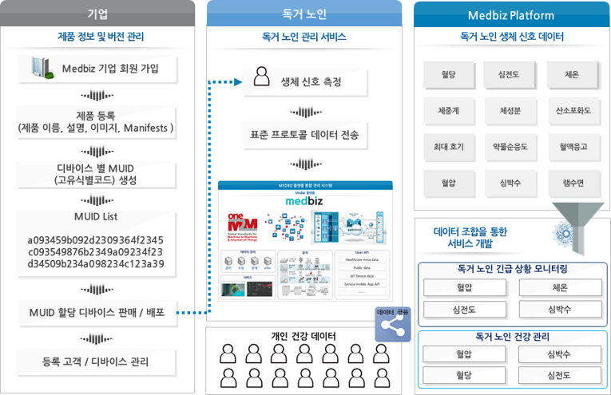
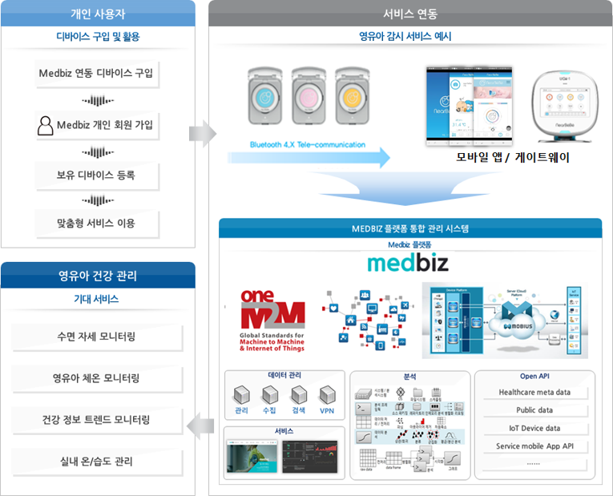

=========================
헬스케어 데이터 활용 예시
=========================

.. contents:: 목차

Medbiz 플랫폼 기업회원 지원 서비스
======================================

* 기업의 개별 디바이스로부터 수집되는 데이터 저장 및 관리 합니다.
* 수집된 데이터는 가상파일시스템을 통해 독립적인 Farm을 구성하며, 기업의 데이터 사일로와는 다른 높은 확장성 및 호환성 제공 합니다.
* Medbiz 플랫폼을 통한 디바이스 사용자의 데이터 관리, 운영의 용이성 확보 가능 합니다.
* 개인 헬스케어 데이터 , 공공의료 데이터 및 병원 데이터의 활용을 통한 매쉬업을제공하여 기존에 존재하는 서비스 및 콘텐츠들 간의 조합을 통해 전혀 새로운서비스 및 콘텐츠를 생산하도록 유도 합니다.
* 표준 프로토콜을 사용하는 OpenAPI를 제공하며 각각의 기능별로 상세 설계와 규격을 정의하여 기업 사용자 및 앱 개발자에게 쉽게 사용할 수 있도록 제공 합니다.

Medbiz 플랫폼 활용 (독거 노인 관리 서비스 예시 )
------------------------------------------------------

  [그림] Medbiz 플랫폼 활용을 통한 독거 노인 관리 서비스 예시

* 기업의 생체 신호 측정 장비를 모니터링 서비스가 필요한 독거 노인에게 배포 및 판매를통해 생체 신호 데이터를 수집 합니다.
* 수집된 데이터는 Medbiz 플랫폼을 통해 저장, 관리 및 공유 가능 합니다.
* 기업에서는 수집된 생체 파라미터의 조합 및 분석을 통해 새로운 서비스 모델 개발에 활용하여 새로운 이익을 창출하도록 지원 합니다.
* 혈압, 체온, 심전도, 심박수 등의 데이터를 조합하여 독거 노인의 현재 상태를 파악하고 독거 노인의 긴급 상황 모니터링 서비스 제공 합니다.
* 혈압, 심박수, 혈당, 심전도 등의 데이터를 조합하여 독거 노인의 건강 관리 서비스 제공
* 다른 종류의 데이터를 제공하는 기업과의 협업을 통해 Compound service mash-up 서비스 개발이 가능합니다.

Medbiz 플랫폼 개인 회원 지원 서비스
=======================================

* 수집된 데이터는 가상파일시스템을 통해 독립적인 Farm을 구성하며, 개인의 의사에 따라공유하여 기업의 서비스를 제공 받을 수 있습니다.
* Medbiz 플랫폼은 클라우드 서비스를 제공하고, 개인 저장 공간의 데이터를 자유롭게 저장, 삭제, 다운로드 및 공유 가능 합니다.
* 개인이 등록한 헬스케어 장비의 다양한 데이터를 연계하여 분석에 활용하는 Medbiz 분석플랫폼을 제공 합니다.
* 표준 프로토콜을 사용하는 OpenAPI를 제공하며 각각의 기능별로 상세 설계와 규격을 정의하여 개인 사용자 및 앱 개발자에게 쉽게 사용할 수 있도록 정의되어 있습니다.
* 개인 헬스케어 데이터를 언제든 다운로드 및 공유가 가능하며, 공유에 따른 다양한 서비스를제공 합니다.

Medbiz 플랫폼 활용 ( 영유아 감시 서비스 예시 )
----------------------------------------------------

  [그림] Medbiz 플랫폼 활용을 통한 영유아 모니터링 서비스 예시

* 영유아의 모니터링 서비스 활용을 위해 디바이스를 구입한 개인 사용자는 Medbiz Site에 가입 후 영유아 감시 디바이스를 등록하여 서비스를 이용할 수 있습니다.
* 기업에서 개발한 영유아 모니터링 모바일 앱을 설치를 통해 디바이스 데이터를Medbiz 플랫폼에 저장하고 관리할 수 있습니다.
* 플랫폼 저장 데이터는 OpenAPI를 통한 통계 및 분석 서비스를 제공 받을 수 있습니다.
* 사용자는 간단한 연동을 통해 디바이스 개발 및 서비스 개발 기업에서 제공하는 서비스를 제공 받을 수 있습니다.
