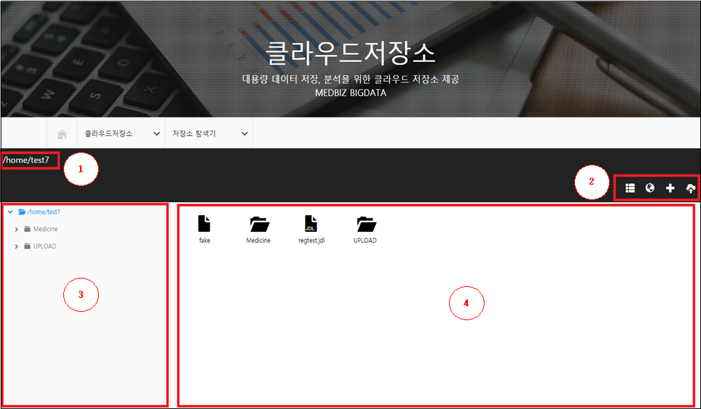
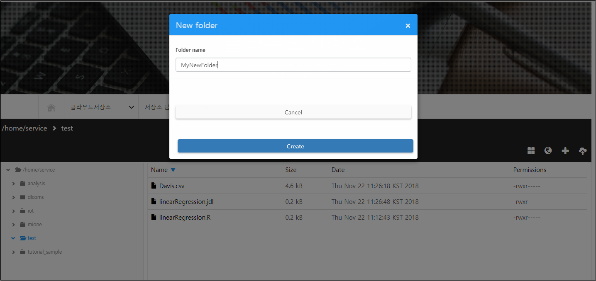
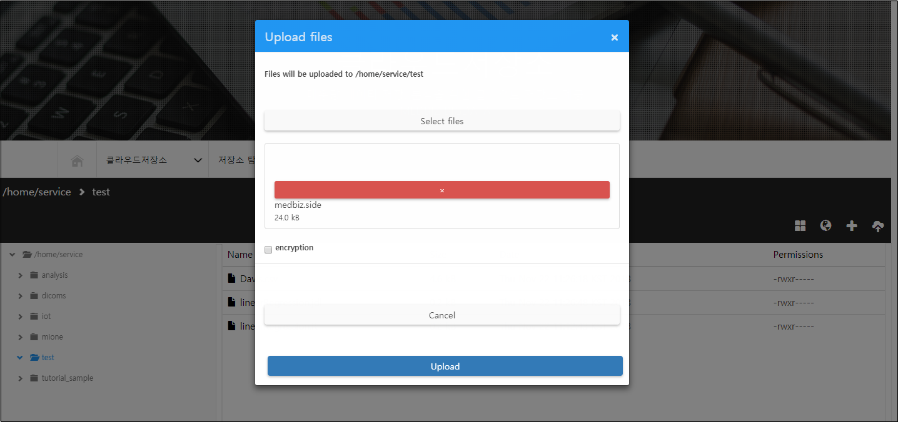
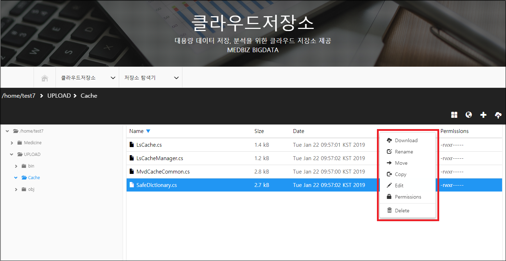
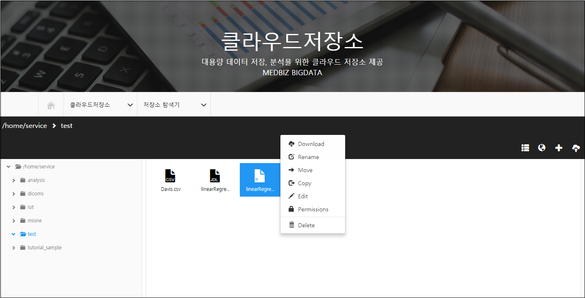
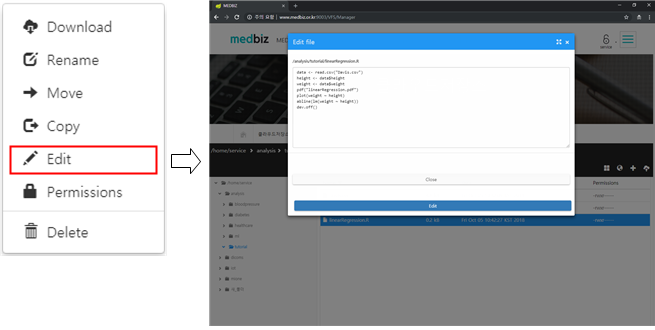
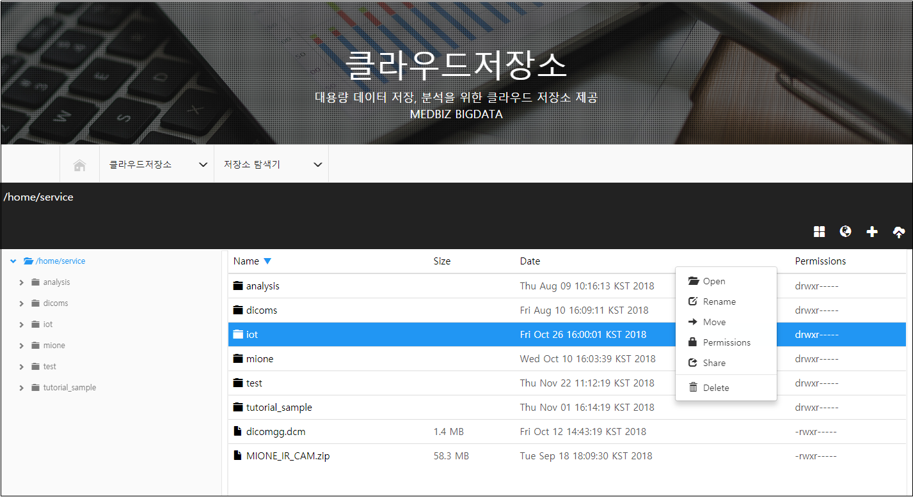
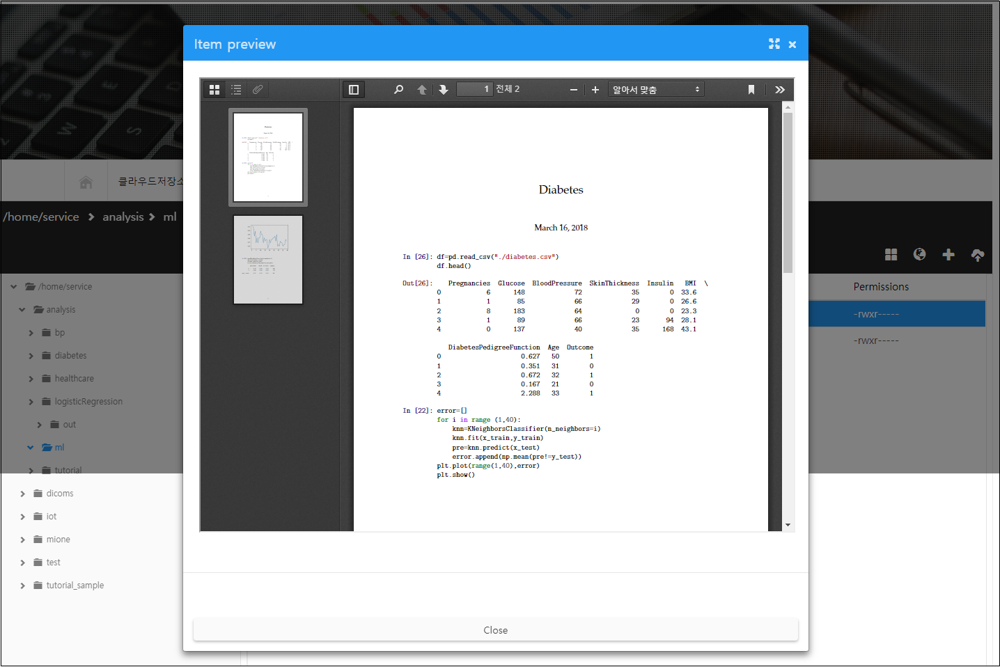
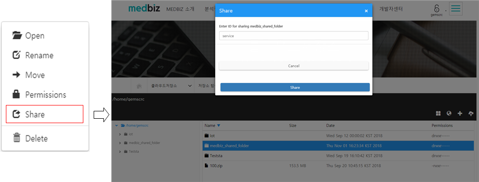
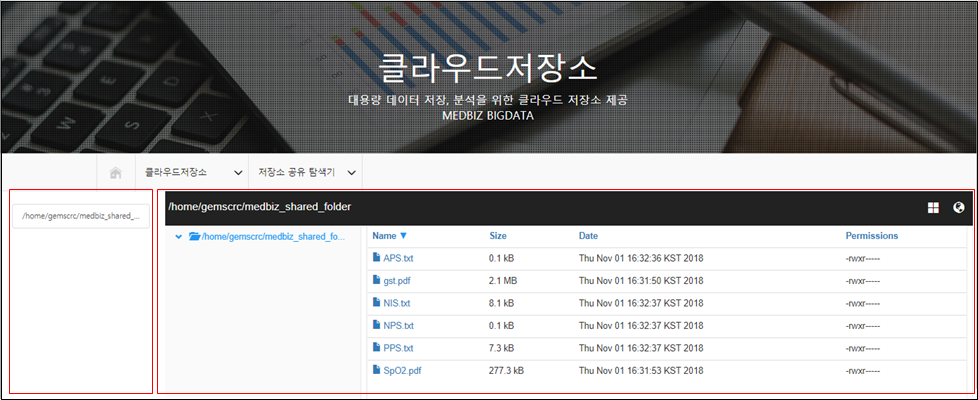

===============
클라우드 저장소
===============

.. contents:: 목차

---------------------------
클라우드 저장소의 개요
---------------------------

Medbiz 플랫폼에서 제공하는 개인 및 기업 사용자를 위한 클라우드 저장소이다. 여기에는 플랫폼에 등록된 IoT 단말로부터 수집된 데이터 파일이 저장되고, 추후 데이터 분석에 활용될 수 있다. 또한, 사용자가 직접 개인 파일을 업로드/다운로드할 수도 있다.

---------------------------
클라우드 저장소의 특징
---------------------------

Medbiz 클라우드 저장소는 Unix 운영체제와 유사한(Unix-like) 파일 시스템을 지원한다. 그러므로 파일 및 폴더의 특성은 Unix 운영체제와 유사하다.

Medbiz 클라우드 저장소는 사용자 아이디별 용량 제한이 있다. 기업 사용자의 경우 협의를 통해 용량을 늘릴 수 있다.

  ○ 기본 제공되는 클라우드 저장소 용량(Quota) : 1 GB

---------------------------
클라우드 저장소 메뉴
---------------------------

Medbiz 홈페이지에 클라우드 저장소 메뉴는 다음과 같다.
 
  * 저장소 탐색기 : 내 클라우드 저장소 탐색
  * 저장소 관리 : 내가 사용한 저장 공간 확인
  * 저장소 공유 탐색기 : 나에게 공유된 저장소 폴더 탐색
  * 데이터 검색 : 메타 정보 기반 클라우드 파일 검색

---------------------------
저장소 탐색기
---------------------------

가. 저장소 탐색기의 개요
============================

저장소 탐색기는 웹브라우저에서 Medbiz 클라우드 저장소의 파일을 보고 관리할 수 있는 서비스다.

저장소 탐색기에서 지원하는 기능은 다음과 같다.

  * 파일 처리 연산
     - 이름 변경(Rename), 이동 (Move), 복사(Copy), 삭제(Delete)
     - 권한 변경(Permissions)

  * 폴더 관련 연산
     - 생성(New Folder)
     - 이름 변경(Rename), 이동 (Move), 삭제(Delete)

  * 파일 다운로드(Download), 업로드(Upload)

  * 파일 편집(Edit)
     - 지원 파일: txt, R, jdl, csv 등의 텍스트 파일
     - 이용 방법: 해당 파일에 대한 컨텍스트 메뉴나 마우스 더블 클릭

  * 파일 미리보기(Preview)
     - 지원 파일: pdf, jpg, png, bmp 등
     - 이용 방법: 마우스 더블 클릭

  * 폴더 공유(Share)

이러한 기능들의 대부분은 선택한 파일에 대한 컨텍스트 메뉴(마우스 팝업 메뉴)를 통하여 이용할 수 있다.

나. 저장소 탐색기 레이아웃
============================

저장소 탐색기의 레이아웃은 다음과 같다.

  < 저장소 탐색기 레이아웃 >

1) 현재 작업 폴더 경로
2) 메뉴 모음
3) 폴더 탐색 창
4) 폴더 내부 탐색 창

다. 저장소 탐색기 메뉴 모음
============================

저장소 탐색기 오른쪽 위에 다음과 같은 기능을 하는 아이콘이 있다.

* |menu_view_layout_icon| List/Icons: 폴더 내부 탐색 창을 리스트/아이콘 모드로 보여줌
* |menu_language_icon| Language: 메뉴 언어 변경(현재 영어(English)만 지원)
* |menu_new_folder| New folder: 새 폴더 만들기
* |menu_upload_files| Upload files: 파일 업로드, 여러 파일 업로드 가능

(1) New folder(새 폴더 만들기)
------------------------------

1) |menu_new_folder| New folder 메뉴를 클릭하면 New folder 창이 나온다.
2) Folder name 항목에 생성할 폴더 이름을 적는다.
3) Create 버튼을 누르면 폴더가 생성된다.

  < New Folder >

(2) Upload files(파일 업로드)
------------------------------

1) |menu_upload_files| Upload files 메뉴를 클릭하면 Upload files 창이 나온다.
2) Select files 버튼을 클릭하여 업로드 할 파일들을 선택한다.   여러 파일을 선택할 수도 있다.
3) Upload 버튼을 눌러 파일을 업로드 한다.

  < Upload files >

라. 파일에 대한 컨텍스트 메뉴(마우스 팝업 메뉴)
===============================================

* Download: 파일 다운로드
* Rename: 파일 이름 변경
* Move: 파일 이동
* Copy: 파일 복사
* Edit: 텍스트 파일 편집
* Permissions: 파일 권한(Unix-like file system permissions) 변경
* Delete: 파일 삭제

  < 파일 팝업 메뉴 >

(1) 파일 다운로드(Download)
------------------------------

선택한 파일에 대한 컨텍스트 메뉴에서 Download 메뉴를 클릭하면 파일을 다운로드할 수 있다. 다운로드 기능은 한 번에 하나의 파일만 다운로드 할 수 있다.

다음 순서대로 수행하여 파일을 다운로드 한다.

1) 다운로드할 파일을 선택한다.
2) 마우스 오른쪽 키를 눌러서 컨텍스트 메뉴를 띄운다.
3) Download 메뉴를 클릭하면, 해당 파일이 다운로드 된다.
4) 다운로드 폴더로 가서 해당 파일이 잘 다운로드 되었는지 확인한다.

  < 파일 다운로드 메뉴 >

(2) 텍스트 파일 편집(Edit)
------------------------------

선택한 파일에 대한 컨텍스트 메뉴에서 Edit 메뉴를 클릭하면 텍스트 파일을 편집할 수 있다. 지원되는 텍스트 파일 확장자로는 txt, R, jdl, csv 등이 있다.

다음 순서대로 수행하여 텍스트 파일을 편집한다.

1) 편집할 텍스트 파일을 선택한다.
2) 마우스 오른쪽 키를 눌러서 컨텍스트 메뉴를 띄운다.
3) Edit 메뉴를 클릭하면 Edit file 창이 나온다.
4) Edit file 창에서 텍스트 파일을 수정한다.
5) Edit file 창에서 Edit 버튼을 클릭하여 수정한 내용을 저장한다. 동시에 Edit file 창은 화면에서 사라진다.
6) 편집했던 파일을 다시 열어서 올바로 편집되었는지 확인한다.

  < 파일 편집 메뉴 >

마. 폴더에 대한 컨텍스트 메뉴(마우스 팝업 메뉴)
===============================================

* Open: 폴더 열기
* Rename: 폴더 이름 변경
* Move: 폴더 이동
* Permissions: 폴더 권한(Unix-like file system permissions) 변경
* Share: 폴더 공유
* Delete: 폴더 삭제(빈 폴더만 삭제 가능)

  < 파일 팝업 메뉴 >

바. 파일 미리보기(Preview)
============================

저장소 탐색기는 pdf 문서 파일과 jpg, png 등 이미지 파일에 대한 미리보기 기능을 지원한다. 해당 파일을 마우스 더블 클릭하면 Item preview 창이 나오고, 여기서 미리보기 기능이 작동된다. Item preview 창을 닫을 때는 오른쪽에 있는 X 버튼을 클릭한다.

  < 파일 미리보기 >

---------------------------
저장소 공유
---------------------------

Medbiz 클라우드 저장소의 특정 폴더를 특정 사용자에게 공유할 수 있다. 특정 폴더를 공유 받은 사용자는 ‘저장소 공유 탐색기’에서 그 폴더를 탐색할 수 있다.

가. 저장소 공유 설정
========================

1) 공유하고자 하는 폴더를 가진 사용자의 계정으로 로그인한다.
2) “클라우드저장소 > 저장소 탐색기” 메뉴를 클릭한다.
3) 공유하고자 하는 폴더를 선택하고, 컨텍스트 메뉴를 띄운다.
4) 컨텍스트 메뉴에서 Share 메뉴를 클릭하여 Share 창을 띄운다.
5) Share 창에 공유 받을 사용자의 아이디(ID)를 지정한다.
6) Share 창의 아래쪽에 Share 버튼을 클릭하면, 공유가 완료된다.

  < 저장소 공유 설정 >
 

나. 공유된 저장소 사용
========================

1) 특정 폴더를 공유 받은 사용자 계정으로 로그인한다.
2) “클라우드저장소 > 저장소 공유 탐색기” 메뉴를 클릭한다.
3) 화면 왼쪽에 나에게 공유된 폴더가 보이고,   오른쪽에서 해당 폴더를 탐색할 수 있다.

  < 공유된 저장소 사용 >
 

---------------------------
데이터 검색
---------------------------

메타 정보를 기반으로 클라우드 저장소의 파일을 검색할 수 있다.

○ 일반 : 전체 데이터를 검색

○ Device 데이터 : Device 데이터만 검색

  < 데이터 검색 >

