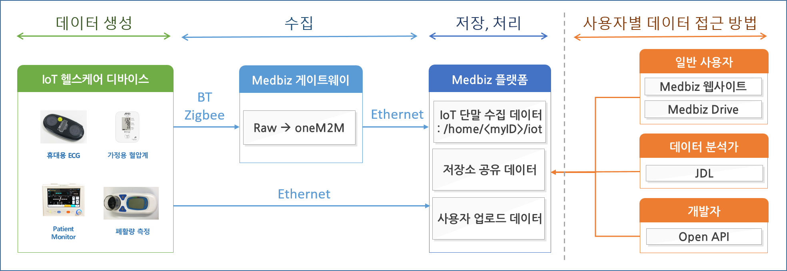

==========================
사용자별 데이터 접근 방법
==========================

.. contents:: 목차

  사용자별 데이터 접근 방법

--------------------------
데이터 생성/수집
--------------------------

사용자가 Medbiz 플랫폼과 연동 가능한 IoT 헬스케어 단말을 구매하고, 단말을 Medbiz 플랫폼에 등록할 수 있다.

단말을 등록하려면, 단말이 이더넷을 통해 Medbiz 플랫폼에 접근가능해야 한다.

단말이 Medbiz 플랫폼에 등록된 후, 사용자가 등록된 단말을 사용하면, 해당 단말이 **생성** 하는 센싱/측정 데이터는 Medbiz 플랫폼으로 전달되어 **수집** 된다.

단말이 Medbiz 플랫폼과 연동가능한 oneM2M 프로토콜을 지원하면, Medbiz 플랫폼으로 직접 연결하여 데이터를 전달할 수 있다. 그렇지 않고, 단말이 Bluetooth, Zigbee 등의 무선 통신을 지원하면, Medbiz 게이트웨이를 거쳐서 Medbiz 플랫폼으로 데이터를 전달할 수 있다.

--------------------------
데이터 저장/업로드/공유
--------------------------

Medbiz 플랫폼은 IoT 단말로 부터 수집된 데이터를 파일 형태로 **저장** 한다. 또한, 사용자가 직접 Medbiz 플랫폼에 데이터를 **업로드** 할 수도 있다. 뿐만 아니라, 자신의 데이터를 디렉터리 단위로 다른 사용자에게 **공유** 할 수도 있다.

--------------------------
데이터 파일 사용 방법
--------------------------

Medbiz 플랫폼에 저장된 데이터는 데이터 분석가, 개발자, 일반 사용자 등이 접근할 수 있다.

**데이터 분석가** 는 JDL(Job Description Language) 파일에 데이터 파일의 위치를 지정함으로써 데이터 파일을 사용할 수 있다. 자세한 내용은 `데이터 분석 스크립트 구동 방법 <analysis.html>`_ 문서를 참고한다.

**개발자** 는 Medbiz 플랫폼에서 제공하는 Open API 를 사용하여 데이터 파일에 접근할 수 있다. 자세한 내용은 `플랫폼 연동 가이드 <../platform_link_guide.html>`_ 문서를 참고한다.

**일반 사용자** 는 Medbiz 웹사이트의 클라우드 저장소 기능을 통해 데이터 파일에 접근할 수 있다. 자세한 내용은 `클라우드 저장소 <cloud_storage_using_guide.html>`_ 문서를 참고한다. 또한, Medbiz Drive 라는 별도의 PC용 프로그램을 통하여 데이터 파일에 접근할 수도 있다. 자세한 내용은 `Medbiz Drive <medbiz_drive_using_guide.html>`_ 문서를 참고한다.

--------------------------
헬스케어 서비스 이용
--------------------------

사용자가 Medbiz 플랫폼에 IoT 헬스케어 단말을 등록하면, Medbiz 웹사이트 제공하는 등록한 단말과 관련된 헬스케어 서비스를 이용할 수 있다. 이 헬스케어 서비스는 등록된 단말에서 Medbiz 플랫폼으로 업로드하는 데이터를 기반으로 서비스된다. 자세한 내용은 `헬스케어 서비스 <medbiz_healthcare_service/using_healthcare_service.html>`_ 문서를 참고한다.
