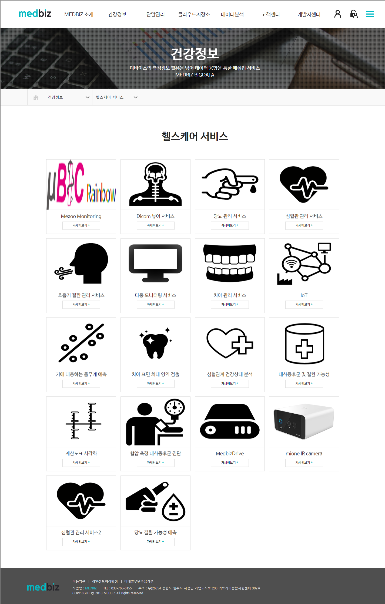
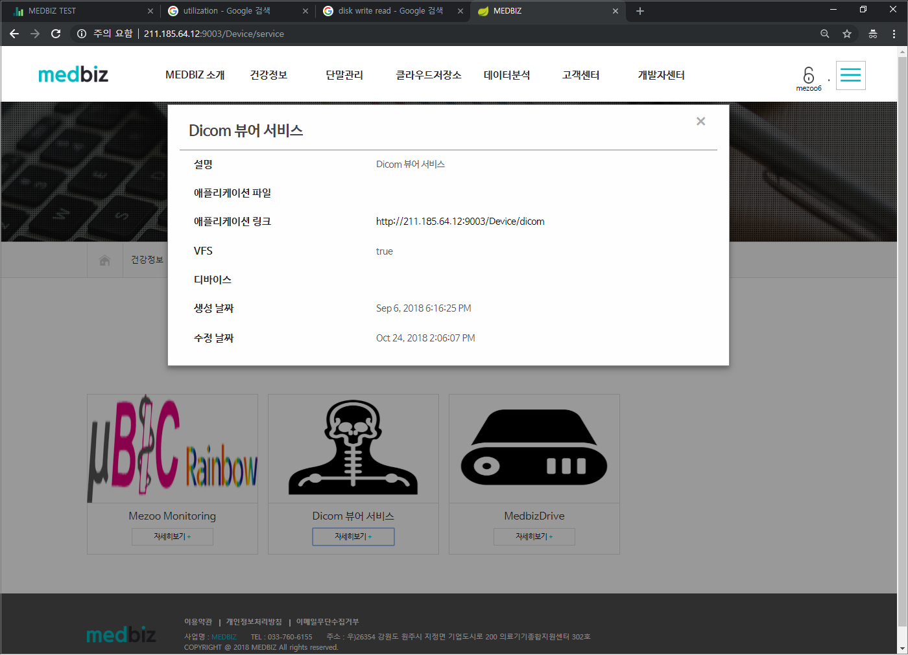

===========================
헬스케어 서비스 이용 방법
===========================

.. contents:: 목차

---------------------------
헬스케어 서비스 - 위치
---------------------------

홈페이지의 "건강정보 > 헬스케어 서비스" 메뉴에서 등록한 단말에 관련된 서비스가 표시됩니다. 이러한 서비스로는 Dicom 뷰어 서비스, 당뇨 관리 서비스, 심혈관 관리 서비스, 호흡기 질환 관리 서비스 등이 있습니다.

* 보유한 단말 또는 VFS 사용 여부에 따라 관련 서비스 제공

  [그림 1] 헬스케어 서비스 리스트 예시

--------------------------------
헬스케어 서비스 - 자세히보기
--------------------------------

각 서비스 항목에 있는 '자세히보기' 버튼을 누르면 애플리케이션 링크를 확인할 수 있습니다. 이 애플리케이션 링크를 클릭하여 해당 서비스를 이용할 수 있습니다.

* 자세히 보기
   - 서비스 상세 정보 확인 및 첨부 파일 다운이나 애플리케이션 링크 제공

  [그림 2] Dicom 뷰어 서비스의 자세히보기 창
