==========
Tutorial
==========

혈압계를 개발하는 업체가 MEDBIZ 플랫폼에 디바이스를 연동하는 과정을 아래의 순서에 따라 직접 따라하며 플랫폼과 연동하는 방법을 알아볼 수 있습니다.

.. note::

    MEDBIZ플랫폼을 활용하는 업체들을 위해 기업용 웹템플릿을 제공하고있습니다.

    기업용 웹 템플릿을 신청하게되면 별도의 접속가능한 웹 페이지가 제공됩니다.

    해당 페이지에서 공지사항과 문의를 받을 수 있는 기능들이 포함되며 테마를 수정하여 기업의 로고를 넣고 배너를 바꾸는 기능등을 제공하고있습니다.

    보다 자세한 정보는 `기업용 웹 템플릿 안내 <https://medbiz.or.kr/contents/view?topMenuNo=5&contentsNo=14&levl=2&menuNo=70>`_ 에서 확인하실 수 있습니다.

WORKFLOW
*********

.. note::

    먼저 MEDBIZ의 회원이 되어야 합니다.
    `여기 <https://medbiz.or.kr>`_ 에서 MEDBIZ에 회원가입을 해주세요

흐름도 추가 필요

.. note::

    플랫폼을 사용하기 위해 필요한 절차를 설명합니다.
    사전 등록 절차를 위해 MEDBIZ 사이트를 통해 1. 도메인 신청 2. 회원가입 및 로그인 3. 제품 등록 절차를 진행해야 하며,
    각 단계별로 등록되는 내용은 다음과 같습니다.

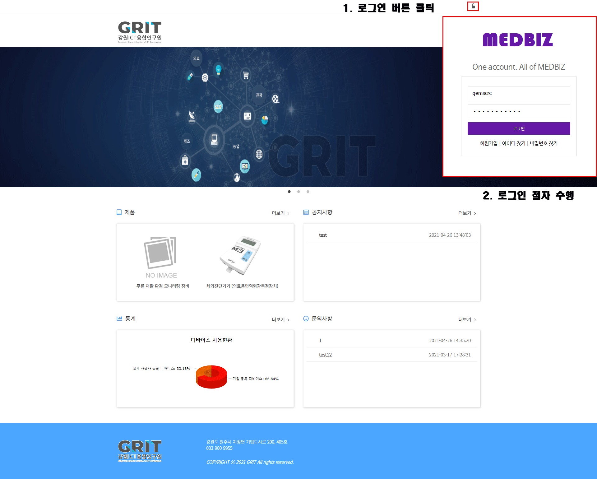

따라하기
*********

#. 제품 관리

제품 관리 - 1. Medbiz Developer 사이트 접속(https://auth.medbiz.or.kr/login) 계정으로  로그인

제품 관리 - 2. 제품을 등록하기 위해 제품 정보를 기입 후, 등록 클릭

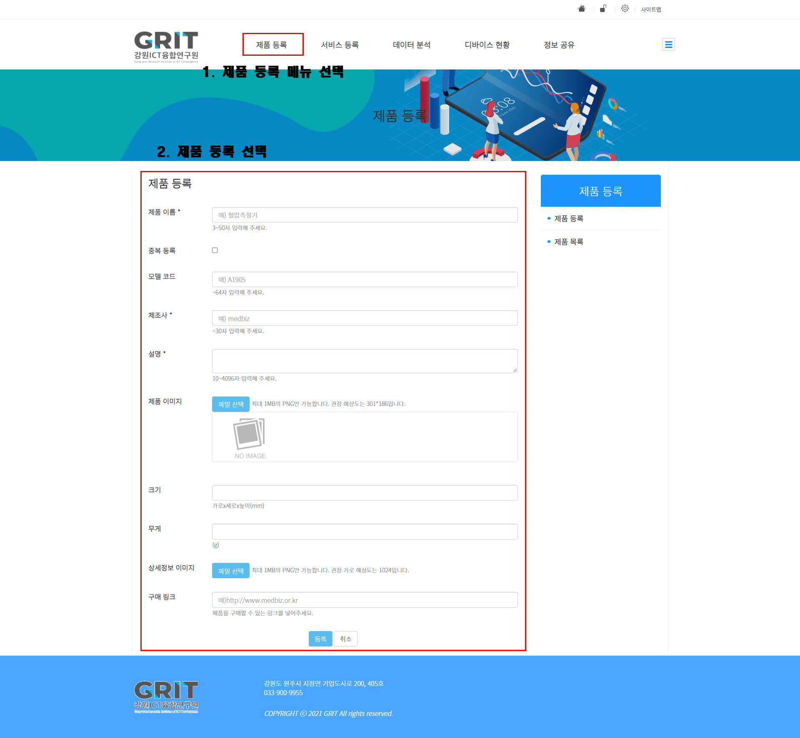

제품 관리 - 3. 내 제품에서 등록된 내용 확인

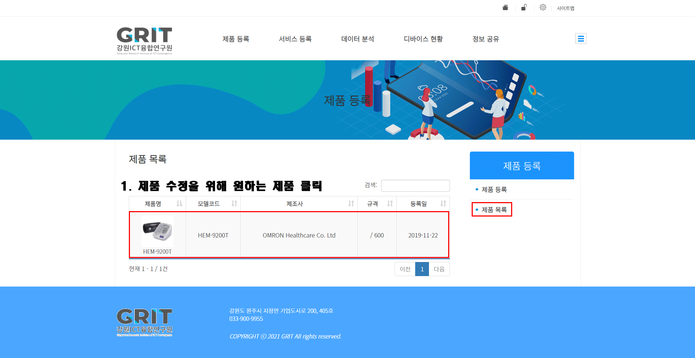

제품관리 - 4. 등록된 제품 관리 화면 > 제품 메니페스트 생성 클릭

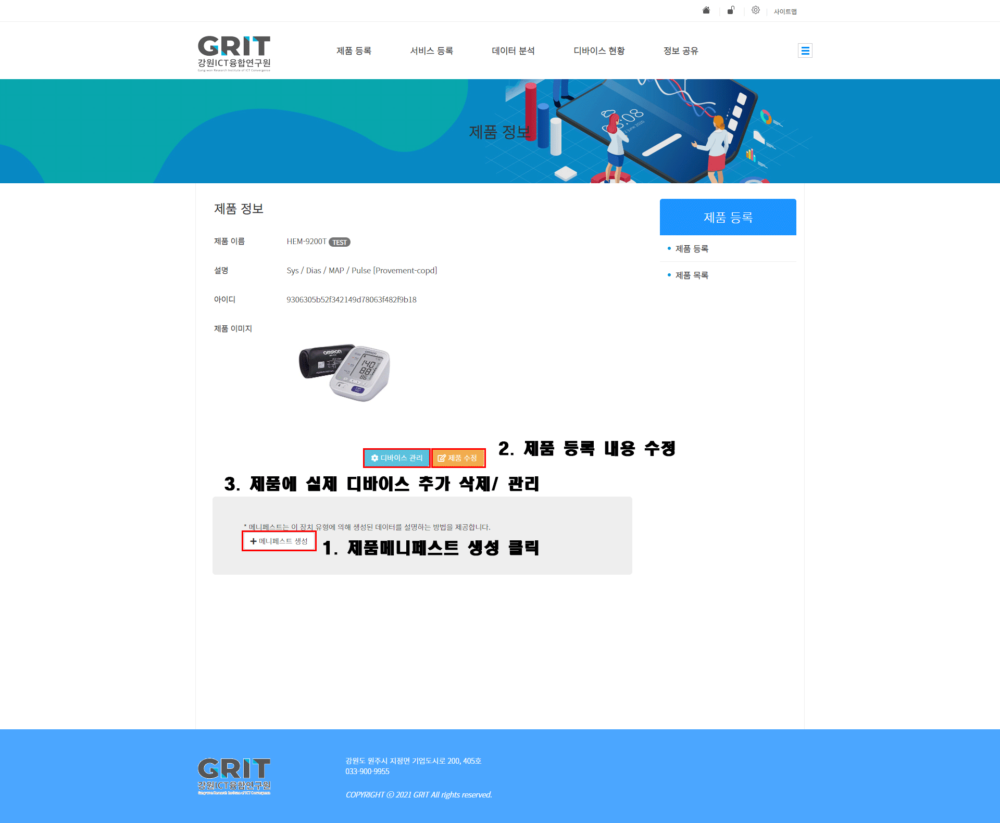

제품관리  - 5. 제품의 메니페스트 생성하기 - 데이터 필드명 및 설명 기입

.. [1] 메니페스트(Manifest)
    - 제품의 특성을 나타내는 정보
    - 해당 제품으로 등록된 디바이스가 생성하는 데이터(필드) 또는 디바이스가 제어를 위해 필요로 하는 데이터(액션)의 모음
    - 매니페스트는 한 개 이상의 파라미터를 가짐
.. [2] 파라미터(Parameter)
    - 디바이스가 생성하는 데이터의 메타데이터 정보
    - 파라미터는 관리자가 관리함(신규 파라미터 추가 시, 관리자 연락)
    - 메타 데이터화를 원치 않거나 기업에서 임의로 데이터를 설계하는 경우에는 기존에 있는 custom 파라미터를 사용

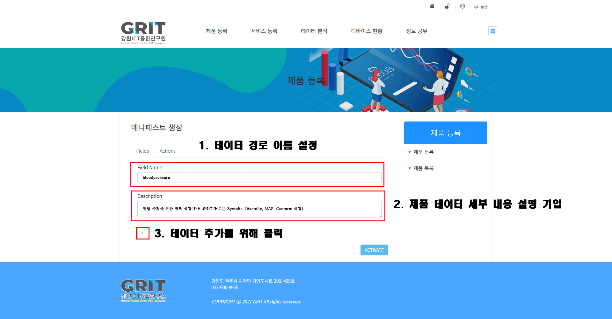

제품관리  - 6. 제품 메니페스트 생성하기 - 데이터 파라미터 설정 1

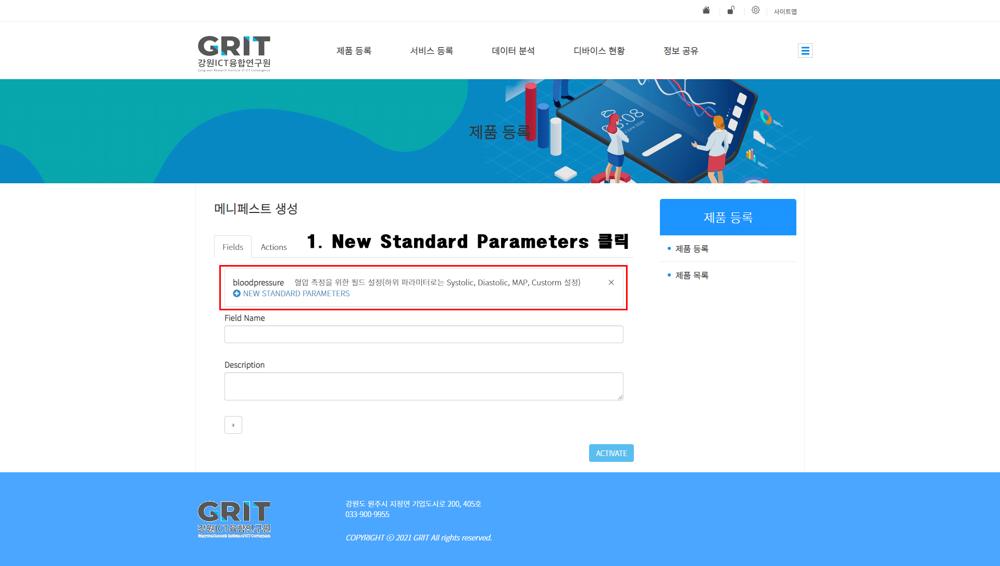

제품관리  - 6. 제품 메니페스트 생성하기 - 데이터 파라미터 설정 2

.. image:: static/enterprise_manifest_Fields_modal.png

제품 관리 - 6. 제품 메니페스트 생성하기 - 선택된 데이터 파라미터 확인 및 등록

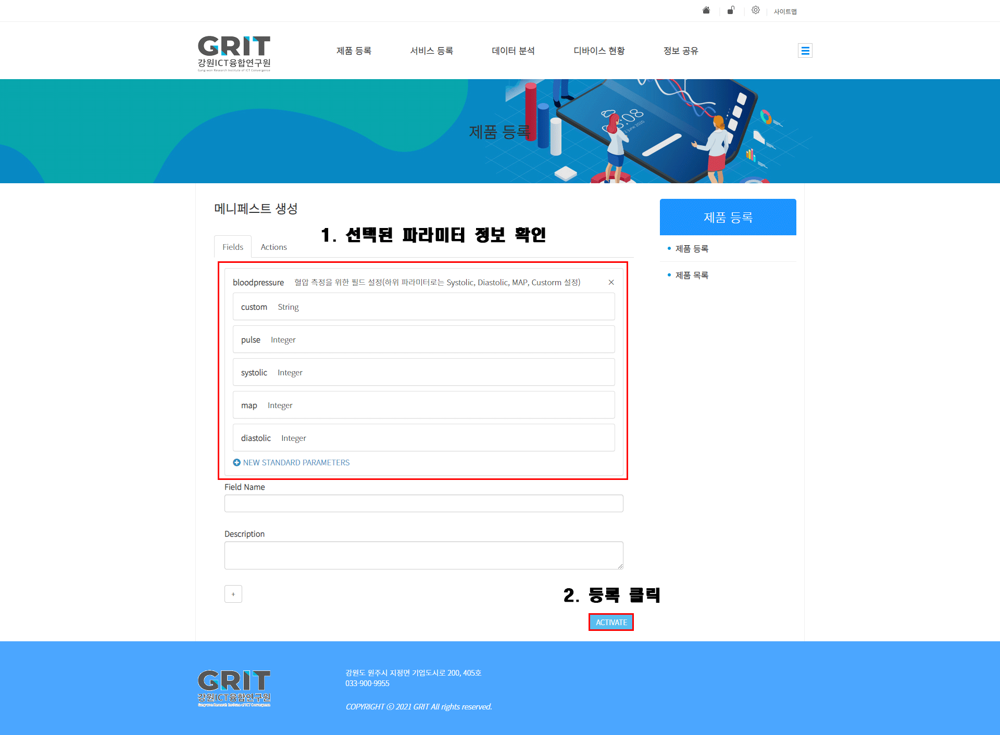

제품 관리 - 6. 제품 메니페스트 생성하기 - 제품에 등록된 데이터 파라미터 및 MUID 확인

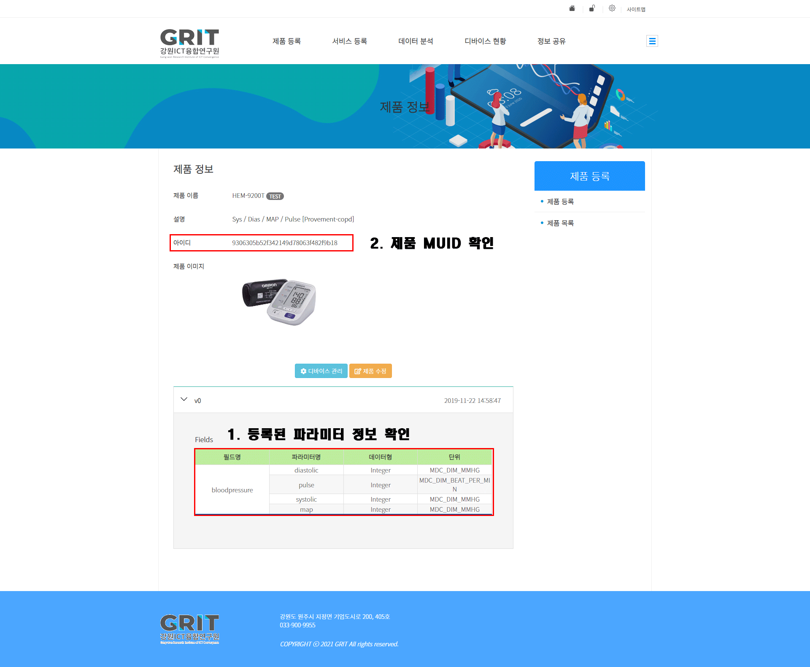

제품 관리 - 7. 제품 디바이스 추가하기 1

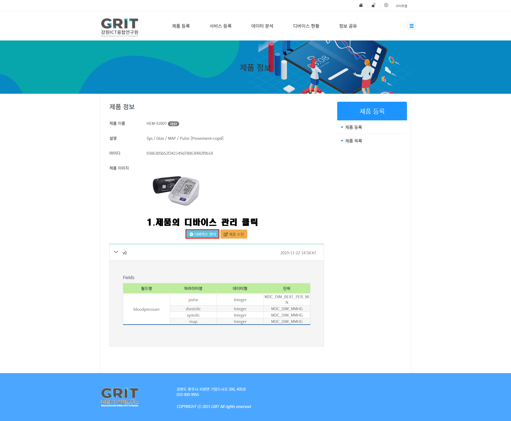

제품 관리 - 7. 제품 디바이스 추가하기 2

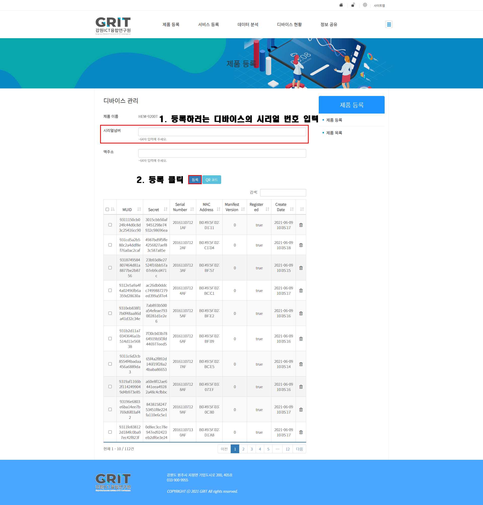

제품 관리 - 7. 제품 디바이스 추가확인

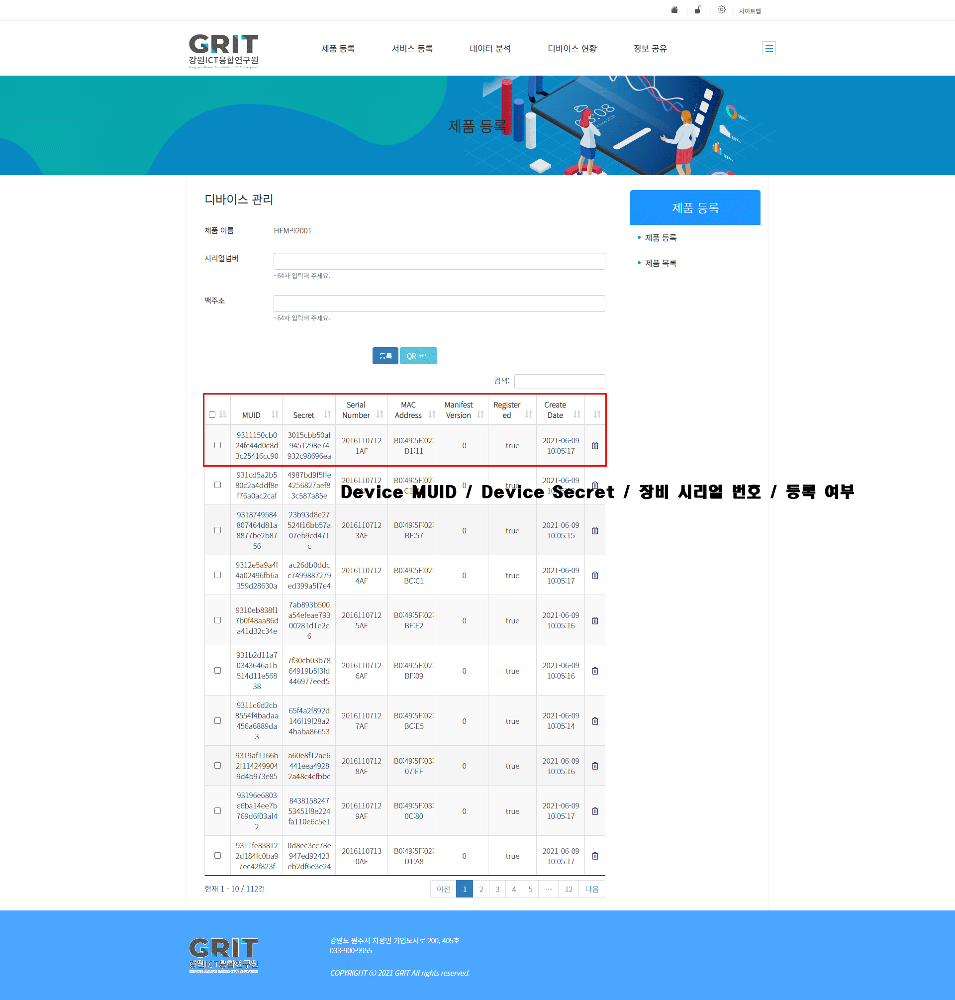

#. 인증 관리

인증 관리 - 1. OAuth Client 등록하기

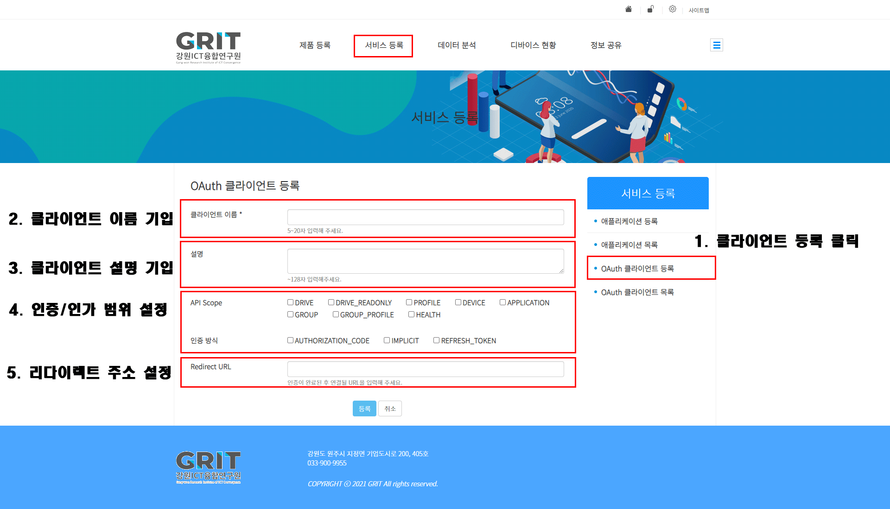

인증 관리 - 2. OAuth Client 리스트 조회

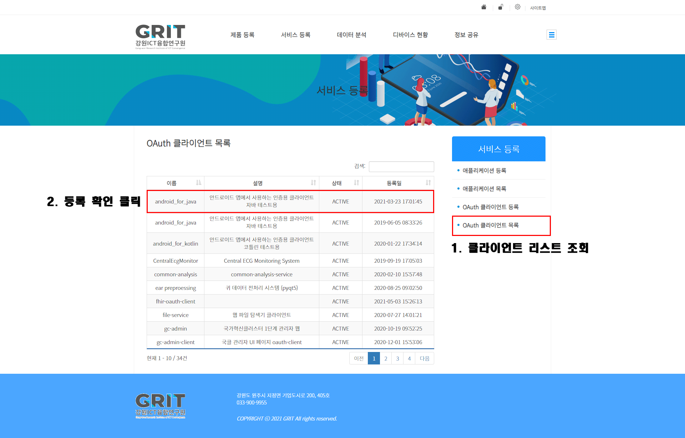

인증 관리 - 3. OAuth Client 정보 조회 및 수정

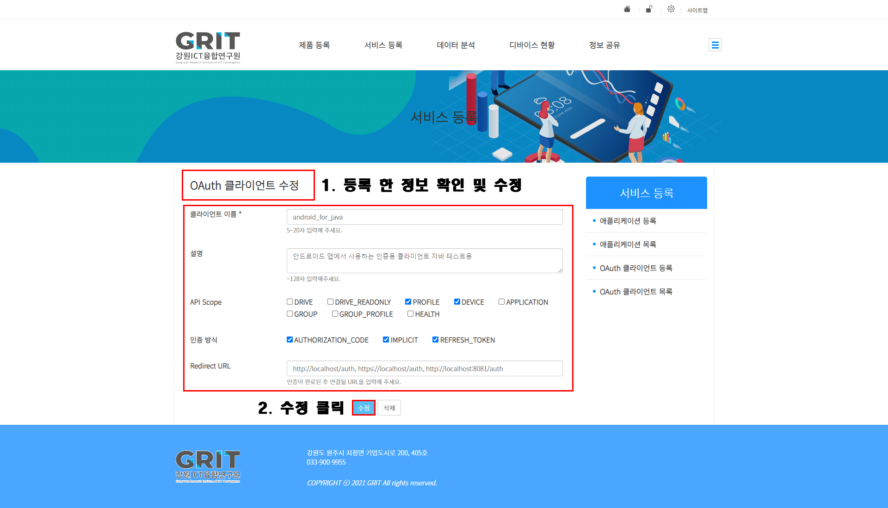

#. 어플리케이션 개발

.. note::

    MEDBIZ 플랫폼에 Android SDK 활용을 위해서는 `여기 <https://medbiz-user-guide.readthedocs.io/>`_
    참조합니다.

